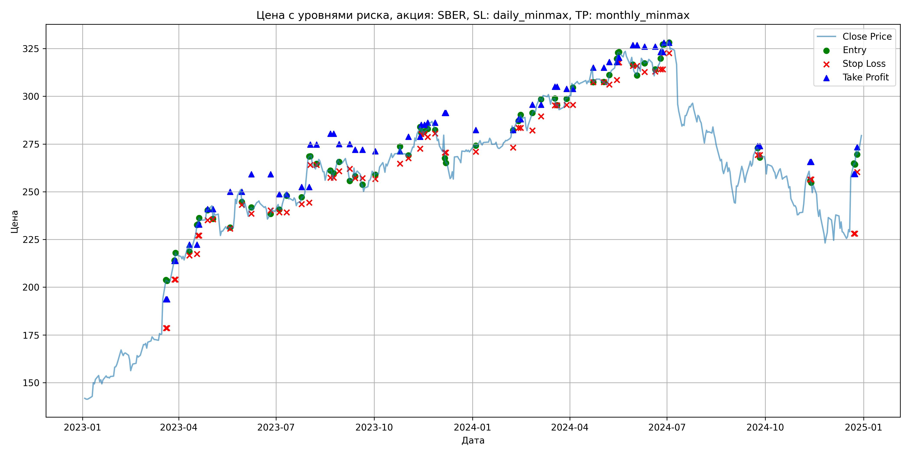
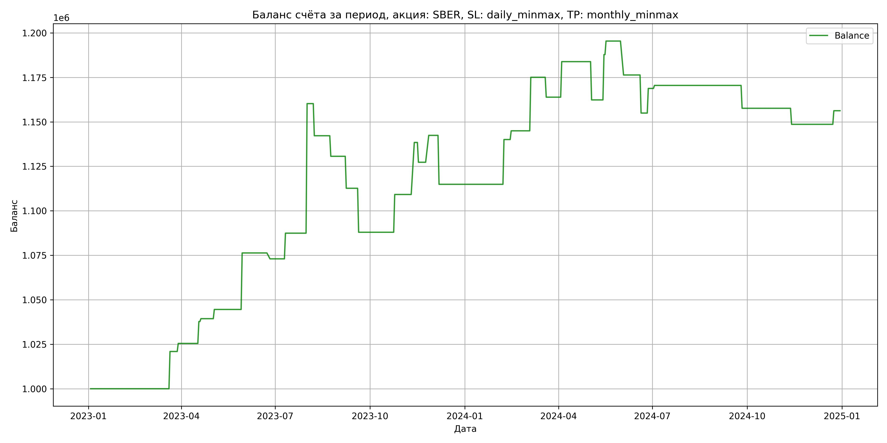

# Результаты торговой стратегии для SBER

**Дата:** 2025-05-17 12:23:27  
**Стратегия:** SBER,_SL_daily_minmax,_TP_monthly_minmax

## Конфигурация

```json
{
    "TICKER": "SBER",
    "EXCHANGE": "MOEX",
    "START_DATE": "2023-01-01",
    "END_DATE": "2024-12-31",
    "INTERVAL": "1d",
    "CAPITAL": 1000000,
    "RISK_PERCENT": 0.02,
    "PROFIT_TO_RISK": 3,
    "ATR_MULTIPLIER": 1.5,
    "ATR_WINDOW": 14,
    "STOP_LOSS_METHOD": "daily_minmax",
    "TAKE_PROFIT_METHOD": "monthly_minmax",
    "POSITION": "long"
}
```

## Метрики эффективности

- **Начальный баланс:** 1000000.00
- **Конечный баланс:** 1156247.46
- **Прибыль/Убыток:** 156247.46 (15.62% за период тестирования)
- **Количество сделок:** 33
- **Процент выигрышных сделок:** 60.61% (20 выигрышных, 13 убыточных)
- **Средняя прибыль:** 18275.22
- **Средний убыток:** -16096.69
- **Максимальная прибыль:** 72817.92
- **Максимальный убыток:** -27502.80
- **Коэффициент прибыли:** 1.75
- **Максимальная просадка:** -6.23%

## Графики

### График цены с уровнями риска



### График баланса счёта



## Завершённые сделки

**Всего сделок:** 67

| Сделка № | Дата | Тип | Покупка / продажа | Количество акций | Цена | Stop Loss в момент сделки | Take Profit в момент сделки | Прибыль / убыток | Прибыль / убыток с учётом комиссии |
|:--------:|:----:|:---:|:-----------------:|:----------------:|:----:|:-------------------------:|:---------------------------:|:----------------:|:----------------------------------:|
| 1 | 2023-03-20 00:00:00 | LONG | BUY | 2395 | 196.02 | 178.56 | 193.69 | 0.00 | -234.73 |
| 2 | 2023-03-21 00:00:00 | LONG | SELL | -2395 | 204.76 | 178.56 | 193.69 | 20932.30 | 20452.37 |
| 3 | 2023-03-28 00:00:00 | LONG | BUY | 2278 | 212.86 | 204.01 | 213.78 | 0.00 | -242.45 |
| 4 | 2023-03-29 00:00:00 | LONG | SELL | -2278 | 214.85 | 204.01 | 213.78 | 4533.22 | 4046.06 |
| 5 | 2023-04-11 00:00:00 | LONG | BUY | 2464 | 222.90 | 216.61 | 222.28 | 0.00 | -274.61 |
| 6 | 2023-04-18 00:00:00 | LONG | SELL | -2464 | 227.89 | 217.43 | 222.28 | 12295.36 | 11739.99 |
| 7 | 2023-04-19 00:00:00 | LONG | BUY | 2487 | 232.67 | 227.05 | 232.80 | 0.00 | -289.33 |
| 8 | 2023-04-20 00:00:00 | LONG | SELL | -2487 | 233.32 | 227.05 | 232.80 | 1616.55 | 1037.09 |
| 9 | 2023-04-28 00:00:00 | LONG | BUY | 2655 | 240.90 | 235.13 | 240.85 | 0.00 | -319.79 |
| 10 | 2023-05-03 00:00:00 | LONG | SELL | -2655 | 242.85 | 235.57 | 240.85 | 5177.25 | 4535.07 |
| 11 | 2023-05-19 00:00:00 | LONG | BUY | 1779 | 230.99 | 230.72 | 249.99 | 0.00 | -205.47 |
| 12 | 2023-05-30 00:00:00 | LONG | SELL | -1779 | 248.84 | 243.14 | 249.99 | 31755.15 | 31328.34 |
| 13 | 2023-06-08 00:00:00 | LONG | BUY | 1945 | 241.30 | 238.56 | 259.18 | 0.00 | -234.66 |
| 14 | 2023-06-26 00:00:00 | LONG | SELL | -1945 | 239.60 | 240.28 | 259.18 | -3306.50 | -3774.18 |
| 15 | 2023-07-04 00:00:00 | LONG | BUY | 2182 | 243.40 | 239.15 | 248.77 | 0.00 | -265.55 |
| 16 | 2023-07-11 00:00:00 | LONG | SELL | -2182 | 250.01 | 239.15 | 248.77 | 14423.02 | 13884.71 |
| 17 | 2023-07-25 00:00:00 | LONG | BUY | 3096 | 245.48 | 243.52 | 252.53 | 0.00 | -380.00 |
| 18 | 2023-08-01 00:00:00 | LONG | SELL | -3096 | 269.00 | 244.26 | 252.53 | 72817.92 | 72021.50 |
| 19 | 2023-08-02 00:00:00 | LONG | BUY | 2743 | 268.50 | 264.10 | 274.77 | 0.00 | -368.25 |
| 20 | 2023-08-08 00:00:00 | LONG | SELL | -2743 | 261.92 | 264.10 | 274.77 | -18048.94 | -18776.41 |
| 21 | 2023-08-21 00:00:00 | LONG | BUY | 2403 | 262.44 | 257.35 | 280.45 | 0.00 | -315.32 |
| 22 | 2023-08-24 00:00:00 | LONG | SELL | -2403 | 257.63 | 257.35 | 280.45 | -11558.43 | -12183.29 |
| 23 | 2023-08-29 00:00:00 | LONG | BUY | 2085 | 266.70 | 260.81 | 274.96 | 0.00 | -278.03 |
| 24 | 2023-09-08 00:00:00 | LONG | SELL | -2085 | 258.08 | 262.04 | 274.96 | -17972.70 | -18519.78 |
| 25 | 2023-09-13 00:00:00 | LONG | BUY | 2575 | 262.40 | 257.09 | 272.05 | 0.00 | -337.84 |
| 26 | 2023-09-20 00:00:00 | LONG | SELL | -2575 | 252.80 | 257.09 | 272.05 | -24720.00 | -25383.32 |
| 27 | 2023-10-02 00:00:00 | LONG | BUY | 2096 | 261.37 | 256.71 | 271.21 | 0.00 | -273.92 |
| 28 | 2023-10-25 00:00:00 | LONG | SELL | -2096 | 271.50 | 264.70 | 271.21 | 21232.48 | 20674.03 |
| 29 | 2023-11-02 00:00:00 | LONG | BUY | 2812 | 270.00 | 267.60 | 278.76 | 0.00 | -379.62 |
| 30 | 2023-11-13 00:00:00 | LONG | SELL | -2812 | 280.40 | 272.59 | 278.76 | 29244.80 | 28470.94 |
| 31 | 2023-11-14 00:00:00 | LONG | BUY | 2784 | 283.70 | 280.32 | 285.04 | 0.00 | -394.91 |
| 32 | 2023-11-17 00:00:00 | LONG | SELL | -2784 | 279.70 | 280.32 | 285.04 | -11136.00 | -11920.25 |
| 33 | 2023-11-20 00:00:00 | LONG | BUY | 2778 | 281.96 | 278.66 | 286.20 | 0.00 | -391.64 |
| 34 | 2023-11-27 00:00:00 | LONG | SELL | -2778 | 287.40 | 280.47 | 286.20 | 15112.32 | 14321.48 |
| 35 | 2023-12-06 00:00:00 | LONG | BUY | 2236 | 279.92 | 270.54 | 291.35 | 0.00 | -312.95 |
| 36 | 2023-12-07 00:00:00 | LONG | SELL | -2236 | 267.62 | 270.54 | 291.35 | -27502.80 | -28114.95 |
| 37 | 2024-01-04 00:00:00 | LONG | BUY | 2555 | 274.67 | 271.00 | 282.35 | 0.00 | -350.89 |
| 38 | 2024-02-08 00:00:00 | LONG | SELL | -2555 | 284.52 | 273.10 | 282.35 | 25166.75 | 24452.38 |
| 39 | 2024-02-13 00:00:00 | LONG | BUY | 2749 | 287.52 | 283.50 | 288.00 | 0.00 | -395.20 |
| 40 | 2024-02-15 00:00:00 | LONG | SELL | -2749 | 289.30 | 283.50 | 288.00 | 4893.22 | 4100.38 |
| 41 | 2024-02-26 00:00:00 | LONG | BUY | 2783 | 288.52 | 282.10 | 295.59 | 0.00 | -401.48 |
| 42 | 2024-03-05 00:00:00 | LONG | SELL | -2783 | 299.33 | 289.47 | 295.59 | 30084.23 | 29266.24 |
| 43 | 2024-03-18 00:00:00 | LONG | BUY | 2725 | 299.40 | 295.29 | 304.98 | 0.00 | -407.93 |
| 44 | 2024-03-20 00:00:00 | LONG | SELL | -2725 | 295.30 | 295.29 | 304.98 | -11172.50 | -11982.78 |
| 45 | 2024-03-29 00:00:00 | LONG | BUY | 2691 | 299.38 | 295.50 | 303.94 | 0.00 | -402.82 |
| 46 | 2024-04-04 00:00:00 | LONG | SELL | -2691 | 306.80 | 295.50 | 303.94 | 19967.22 | 19151.60 |
| 47 | 2024-04-23 00:00:00 | LONG | BUY | 2597 | 315.39 | 307.38 | 315.00 | 0.00 | -409.53 |
| 48 | 2024-05-03 00:00:00 | LONG | SELL | -2597 | 307.11 | 307.38 | 315.00 | -21503.16 | -22311.48 |
| 49 | 2024-05-08 00:00:00 | LONG | BUY | 2603 | 308.41 | 306.21 | 318.01 | 0.00 | -401.40 |
| 50 | 2024-05-15 00:00:00 | LONG | SELL | -2603 | 318.20 | 308.55 | 318.01 | 25483.37 | 24667.84 |
| 51 | 2024-05-16 00:00:00 | LONG | BUY | 2564 | 320.00 | 317.70 | 320.24 | 0.00 | -410.24 |
| 52 | 2024-05-17 00:00:00 | LONG | SELL | -2564 | 322.96 | 317.70 | 320.24 | 7589.44 | 6765.17 |
| 53 | 2024-05-30 00:00:00 | LONG | BUY | 2573 | 320.91 | 315.92 | 326.81 | 0.00 | -412.85 |
| 54 | 2024-06-03 00:00:00 | LONG | SELL | -2573 | 313.50 | 315.92 | 326.81 | -19065.93 | -19882.10 |
| 55 | 2024-06-10 00:00:00 | LONG | BUY | 2119 | 320.80 | 312.73 | 326.09 | 0.00 | -339.89 |
| 56 | 2024-06-20 00:00:00 | LONG | SELL | -2119 | 310.70 | 312.96 | 326.09 | -21401.90 | -22070.97 |
| 57 | 2024-06-25 00:00:00 | LONG | BUY | 1896 | 317.50 | 314.14 | 323.16 | 0.00 | -300.99 |
| 58 | 2024-06-27 00:00:00 | LONG | SELL | -1896 | 324.80 | 314.14 | 323.16 | 13840.80 | 13231.90 |
| 59 | 2024-06-28 00:00:00 | LONG | BUY | 2390 | 327.87 | 322.63 | 328.03 | 0.00 | -391.80 |
| 60 | 2024-07-03 00:00:00 | LONG | SELL | -2390 | 328.58 | 322.63 | 328.03 | 1696.90 | 912.44 |
| 61 | 2024-09-24 00:00:00 | LONG | BUY | 2021 | 273.90 | 269.30 | 273.95 | 0.00 | -276.78 |
| 62 | 2024-09-26 00:00:00 | LONG | SELL | -2021 | 267.54 | 269.30 | 273.95 | -12853.56 | -13400.69 |
| 63 | 2024-11-12 00:00:00 | LONG | BUY | 1918 | 259.99 | 256.49 | 265.67 | 0.00 | -249.33 |
| 64 | 2024-11-13 00:00:00 | LONG | SELL | -1918 | 255.29 | 256.49 | 265.67 | -9014.60 | -9508.75 |
| 65 | 2024-12-23 00:00:00 | LONG | BUY | 1547 | 260.00 | 228.03 | 259.31 | 0.00 | -201.11 |
| 66 | 2024-12-24 00:00:00 | LONG | SELL | -1547 | 264.94 | 228.03 | 259.31 | 7642.18 | 7236.14 |
| 67 | 2024-12-26 00:00:00 | LONG | BUY | 1468 | 272.00 | 260.31 | 273.31 | 0.00 | -199.65 |
