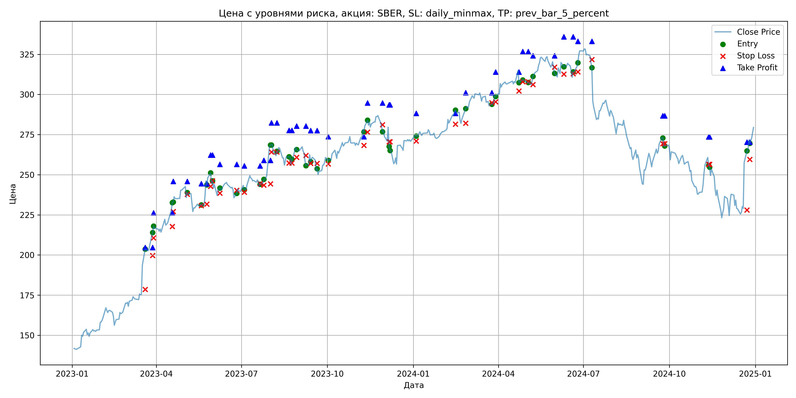
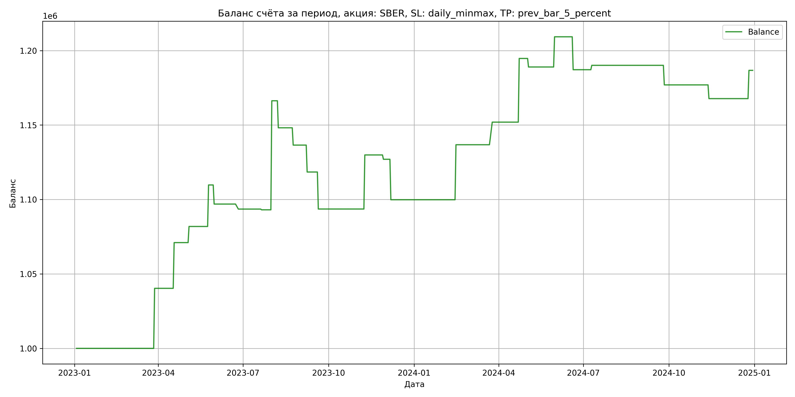

# Результаты торговой стратегии для SBER

**Дата:** 2025-05-17 12:23:25  
**Стратегия:** SBER,_SL_daily_minmax,_TP_prev_bar_5_percent

## Конфигурация

```json
{
    "TICKER": "SBER",
    "EXCHANGE": "MOEX",
    "START_DATE": "2023-01-01",
    "END_DATE": "2024-12-31",
    "INTERVAL": "1d",
    "CAPITAL": 1000000,
    "RISK_PERCENT": 0.02,
    "PROFIT_TO_RISK": 3,
    "ATR_MULTIPLIER": 1.5,
    "ATR_WINDOW": 14,
    "STOP_LOSS_METHOD": "daily_minmax",
    "TAKE_PROFIT_METHOD": "prev_bar_5_percent",
    "POSITION": "long"
}
```

## Метрики эффективности

- **Начальный баланс:** 1000000.00
- **Конечный баланс:** 1186736.75
- **Прибыль/Убыток:** 186736.75 (18.67% за период тестирования)
- **Количество сделок:** 25
- **Процент выигрышных сделок:** 48.00% (12 выигрышных, 13 убыточных)
- **Средняя прибыль:** 29701.67
- **Средний убыток:** -13052.56
- **Максимальная прибыль:** 73241.28
- **Максимальный убыток:** -27170.70
- **Коэффициент прибыли:** 2.10
- **Максимальная просадка:** -6.23%

## Графики

### График цены с уровнями риска



### График баланса счёта



## Завершённые сделки

**Всего сделок:** 50

| Сделка № | Дата | Тип | Покупка / продажа | Количество акций | Цена | Stop Loss в момент сделки | Take Profit в момент сделки | Прибыль / убыток | Прибыль / убыток с учётом комиссии |
|:--------:|:----:|:---:|:-----------------:|:----------------:|:----:|:-------------------------:|:---------------------------:|:----------------:|:----------------------------------:|
| 1 | 2023-03-20 00:00:00 | LONG | BUY | 2395 | 196.02 | 178.56 | 204.61 | 0.00 | -234.73 |
| 2 | 2023-03-28 00:00:00 | LONG | SELL | -2395 | 212.86 | 199.66 | 204.61 | 40331.80 | 39842.17 |
| 3 | 2023-03-29 00:00:00 | LONG | BUY | 2355 | 214.85 | 210.67 | 226.21 | 0.00 | -252.99 |
| 4 | 2023-04-18 00:00:00 | LONG | SELL | -2355 | 227.89 | 217.77 | 226.21 | 30709.20 | 30187.87 |
| 5 | 2023-04-19 00:00:00 | LONG | BUY | 2568 | 232.67 | 227.05 | 245.90 | 0.00 | -298.75 |
| 6 | 2023-05-04 00:00:00 | LONG | SELL | -2568 | 236.89 | 237.77 | 245.90 | 10836.96 | 10234.04 |
| 7 | 2023-05-19 00:00:00 | LONG | BUY | 1845 | 230.99 | 230.72 | 244.44 | 0.00 | -213.09 |
| 8 | 2023-05-25 00:00:00 | LONG | SELL | -1845 | 246.10 | 231.70 | 244.44 | 27877.95 | 27437.83 |
| 9 | 2023-05-29 00:00:00 | LONG | BUY | 2219 | 249.78 | 242.81 | 262.22 | 0.00 | -277.13 |
| 10 | 2023-05-31 00:00:00 | LONG | SELL | -2219 | 244.00 | 246.16 | 262.22 | -12825.82 | -13373.67 |
| 11 | 2023-06-08 00:00:00 | LONG | BUY | 1983 | 241.30 | 238.56 | 256.51 | 0.00 | -239.25 |
| 12 | 2023-06-26 00:00:00 | LONG | SELL | -1983 | 239.60 | 240.28 | 256.51 | -3371.10 | -3847.91 |
| 13 | 2023-07-04 00:00:00 | LONG | BUY | 2225 | 243.40 | 239.15 | 255.50 | 0.00 | -270.78 |
| 14 | 2023-07-21 00:00:00 | LONG | SELL | -2225 | 243.18 | 244.41 | 255.50 | -489.50 | -1030.82 |
| 15 | 2023-07-25 00:00:00 | LONG | BUY | 3114 | 245.48 | 243.52 | 258.95 | 0.00 | -382.21 |
| 16 | 2023-08-01 00:00:00 | LONG | SELL | -3114 | 269.00 | 244.26 | 258.95 | 73241.28 | 72440.23 |
| 17 | 2023-08-02 00:00:00 | LONG | BUY | 2759 | 268.50 | 264.10 | 282.39 | 0.00 | -370.40 |
| 18 | 2023-08-08 00:00:00 | LONG | SELL | -2759 | 261.92 | 264.10 | 282.39 | -18154.22 | -18885.93 |
| 19 | 2023-08-21 00:00:00 | LONG | BUY | 2417 | 262.44 | 257.35 | 277.66 | 0.00 | -317.16 |
| 20 | 2023-08-24 00:00:00 | LONG | SELL | -2417 | 257.63 | 257.35 | 277.66 | -11625.77 | -12254.27 |
| 21 | 2023-08-29 00:00:00 | LONG | BUY | 2097 | 266.70 | 260.81 | 280.28 | 0.00 | -279.63 |
| 22 | 2023-09-08 00:00:00 | LONG | SELL | -2097 | 258.08 | 262.04 | 280.28 | -18076.14 | -18626.37 |
| 23 | 2023-09-13 00:00:00 | LONG | BUY | 2589 | 262.40 | 257.09 | 277.49 | 0.00 | -339.68 |
| 24 | 2023-09-20 00:00:00 | LONG | SELL | -2589 | 252.80 | 257.09 | 277.49 | -24854.40 | -25521.33 |
| 25 | 2023-10-02 00:00:00 | LONG | BUY | 2108 | 261.37 | 256.71 | 273.76 | 0.00 | -275.48 |
| 26 | 2023-11-09 00:00:00 | LONG | SELL | -2108 | 278.60 | 268.26 | 273.76 | 36320.84 | 35751.71 |
| 27 | 2023-11-13 00:00:00 | LONG | BUY | 2803 | 280.40 | 276.60 | 294.69 | 0.00 | -392.98 |
| 28 | 2023-11-29 00:00:00 | LONG | SELL | -2803 | 279.36 | 281.11 | 294.69 | -2915.12 | -3699.62 |
| 29 | 2023-12-06 00:00:00 | LONG | BUY | 2209 | 279.92 | 270.54 | 293.60 | 0.00 | -309.17 |
| 30 | 2023-12-07 00:00:00 | LONG | SELL | -2209 | 267.62 | 270.54 | 293.60 | -27170.70 | -27775.46 |
| 31 | 2024-01-04 00:00:00 | LONG | BUY | 2525 | 274.67 | 271.00 | 288.29 | 0.00 | -346.77 |
| 32 | 2024-02-15 00:00:00 | LONG | SELL | -2525 | 289.30 | 281.53 | 288.29 | 36940.75 | 36228.74 |
| 33 | 2024-02-26 00:00:00 | LONG | BUY | 2770 | 288.52 | 282.10 | 301.14 | 0.00 | -399.60 |
| 34 | 2024-03-25 00:00:00 | LONG | SELL | -2770 | 294.00 | 294.88 | 301.14 | 15179.60 | 14372.81 |
| 35 | 2024-03-29 00:00:00 | LONG | BUY | 2672 | 299.38 | 295.50 | 313.95 | 0.00 | -399.97 |
| 36 | 2024-04-23 00:00:00 | LONG | SELL | -2672 | 315.39 | 302.12 | 313.95 | 42778.72 | 41957.39 |
| 37 | 2024-04-27 00:00:00 | LONG | BUY | 2680 | 309.25 | 308.00 | 326.77 | 0.00 | -414.40 |
| 38 | 2024-05-03 00:00:00 | LONG | SELL | -2680 | 307.11 | 308.00 | 326.77 | -5735.20 | -6561.12 |
| 39 | 2024-05-08 00:00:00 | LONG | BUY | 2672 | 308.41 | 306.21 | 324.17 | 0.00 | -412.04 |
| 40 | 2024-05-31 00:00:00 | LONG | SELL | -2672 | 316.00 | 317.07 | 324.17 | 20280.48 | 19446.27 |
| 41 | 2024-06-10 00:00:00 | LONG | BUY | 2189 | 320.80 | 312.73 | 335.89 | 0.00 | -351.12 |
| 42 | 2024-06-20 00:00:00 | LONG | SELL | -2189 | 310.70 | 312.96 | 335.89 | -22108.90 | -22800.08 |
| 43 | 2024-06-25 00:00:00 | LONG | BUY | 1959 | 317.50 | 314.14 | 333.11 | 0.00 | -310.99 |
| 44 | 2024-07-10 00:00:00 | LONG | SELL | -1959 | 319.00 | 321.80 | 333.11 | 2938.50 | 2315.05 |
| 45 | 2024-09-24 00:00:00 | LONG | BUY | 2066 | 273.90 | 269.30 | 286.69 | 0.00 | -282.94 |
| 46 | 2024-09-26 00:00:00 | LONG | SELL | -2066 | 267.54 | 269.30 | 286.69 | -13139.76 | -13699.07 |
| 47 | 2024-11-12 00:00:00 | LONG | BUY | 1961 | 259.99 | 256.49 | 273.64 | 0.00 | -254.92 |
| 48 | 2024-11-13 00:00:00 | LONG | SELL | -1961 | 255.29 | 256.49 | 273.64 | -9216.70 | -9721.93 |
| 49 | 2024-12-23 00:00:00 | LONG | BUY | 1582 | 260.00 | 228.03 | 270.35 | 0.00 | -205.66 |
| 50 | 2024-12-26 00:00:00 | LONG | SELL | -1582 | 272.00 | 259.60 | 270.35 | 18984.00 | 18563.19 |
