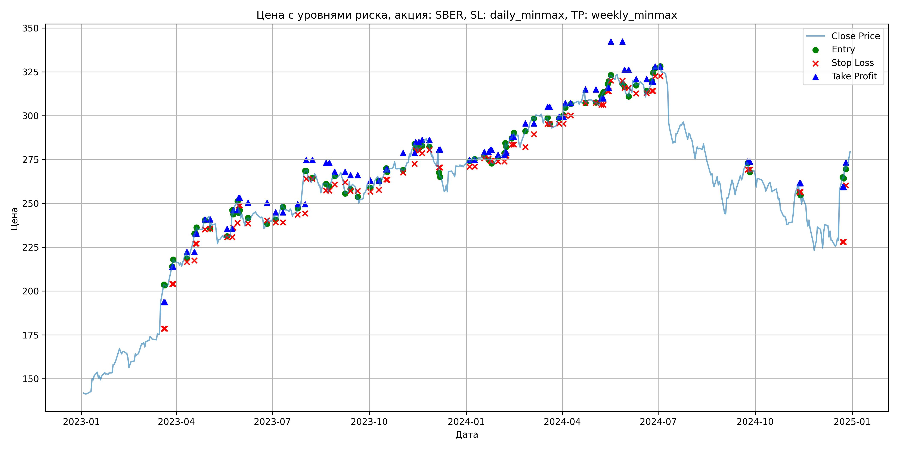
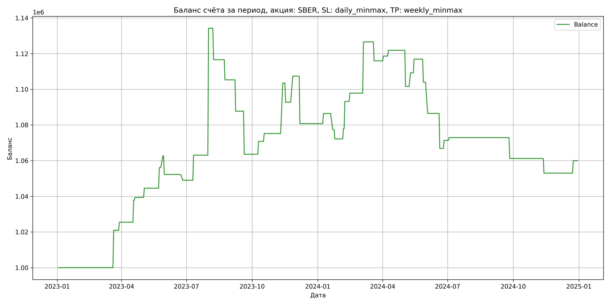

# Результаты торговой стратегии для SBER

**Дата:** 2025-05-17 12:23:26  
**Стратегия:** SBER,_SL_daily_minmax,_TP_weekly_minmax

## Конфигурация

```json
{
    "TICKER": "SBER",
    "EXCHANGE": "MOEX",
    "START_DATE": "2023-01-01",
    "END_DATE": "2024-12-31",
    "INTERVAL": "1d",
    "CAPITAL": 1000000,
    "RISK_PERCENT": 0.02,
    "PROFIT_TO_RISK": 3,
    "ATR_MULTIPLIER": 1.5,
    "ATR_WINDOW": 14,
    "STOP_LOSS_METHOD": "daily_minmax",
    "TAKE_PROFIT_METHOD": "weekly_minmax",
    "POSITION": "long"
}
```

## Метрики эффективности

- **Начальный баланс:** 1000000.00
- **Конечный баланс:** 1059950.93
- **Прибыль/Убыток:** 59950.93 (6.00% за период тестирования)
- **Количество сделок:** 42
- **Процент выигрышных сделок:** 59.52% (25 выигрышных, 17 убыточных)
- **Средняя прибыль:** 11870.83
- **Средний убыток:** -13930.58
- **Максимальная прибыль:** 71124.48
- **Максимальный убыток:** -26604.90
- **Коэффициент прибыли:** 1.25
- **Максимальная просадка:** -7.16%

## Графики

### График цены с уровнями риска



### График баланса счёта



## Завершённые сделки

**Всего сделок:** 85

| Сделка № | Дата | Тип | Покупка / продажа | Количество акций | Цена | Stop Loss в момент сделки | Take Profit в момент сделки | Прибыль / убыток | Прибыль / убыток с учётом комиссии |
|:--------:|:----:|:---:|:-----------------:|:----------------:|:----:|:-------------------------:|:---------------------------:|:----------------:|:----------------------------------:|
| 1 | 2023-03-20 00:00:00 | LONG | BUY | 2395 | 196.02 | 178.56 | 193.69 | 0.00 | -234.73 |
| 2 | 2023-03-21 00:00:00 | LONG | SELL | -2395 | 204.76 | 178.56 | 193.69 | 20932.30 | 20452.37 |
| 3 | 2023-03-28 00:00:00 | LONG | BUY | 2278 | 212.86 | 204.01 | 213.78 | 0.00 | -242.45 |
| 4 | 2023-03-29 00:00:00 | LONG | SELL | -2278 | 214.85 | 204.01 | 213.78 | 4533.22 | 4046.06 |
| 5 | 2023-04-11 00:00:00 | LONG | BUY | 2464 | 222.90 | 216.61 | 222.28 | 0.00 | -274.61 |
| 6 | 2023-04-18 00:00:00 | LONG | SELL | -2464 | 227.89 | 217.43 | 222.28 | 12295.36 | 11739.99 |
| 7 | 2023-04-19 00:00:00 | LONG | BUY | 2487 | 232.67 | 227.05 | 232.80 | 0.00 | -289.33 |
| 8 | 2023-04-20 00:00:00 | LONG | SELL | -2487 | 233.32 | 227.05 | 232.80 | 1616.55 | 1037.09 |
| 9 | 2023-04-28 00:00:00 | LONG | BUY | 2655 | 240.90 | 235.13 | 240.85 | 0.00 | -319.79 |
| 10 | 2023-05-03 00:00:00 | LONG | SELL | -2655 | 242.85 | 235.57 | 240.85 | 5177.25 | 4535.07 |
| 11 | 2023-05-19 00:00:00 | LONG | BUY | 1779 | 230.99 | 230.72 | 235.54 | 0.00 | -205.47 |
| 12 | 2023-05-24 00:00:00 | LONG | SELL | -1779 | 237.49 | 230.72 | 235.54 | 11563.50 | 11146.79 |
| 13 | 2023-05-25 00:00:00 | LONG | BUY | 1770 | 246.10 | 236.26 | 246.15 | 0.00 | -217.80 |
| 14 | 2023-05-29 00:00:00 | LONG | SELL | -1770 | 249.78 | 238.88 | 246.15 | 6513.60 | 6074.75 |
| 15 | 2023-05-30 00:00:00 | LONG | BUY | 2152 | 248.84 | 248.85 | 253.19 | 0.00 | -267.75 |
| 16 | 2023-05-31 00:00:00 | LONG | SELL | -2152 | 244.00 | 248.85 | 253.19 | -10415.68 | -10945.98 |
| 17 | 2023-06-08 00:00:00 | LONG | BUY | 1899 | 241.30 | 238.56 | 250.34 | 0.00 | -229.11 |
| 18 | 2023-06-26 00:00:00 | LONG | SELL | -1899 | 239.60 | 240.28 | 250.34 | -3228.30 | -3684.91 |
| 19 | 2023-07-04 00:00:00 | LONG | BUY | 2131 | 243.40 | 239.15 | 244.87 | 0.00 | -259.34 |
| 20 | 2023-07-11 00:00:00 | LONG | SELL | -2131 | 250.01 | 239.15 | 244.87 | 14085.91 | 13560.18 |
| 21 | 2023-07-25 00:00:00 | LONG | BUY | 3024 | 245.48 | 243.52 | 249.51 | 0.00 | -371.17 |
| 22 | 2023-08-01 00:00:00 | LONG | SELL | -3024 | 269.00 | 244.26 | 249.51 | 71124.48 | 70346.59 |
| 23 | 2023-08-02 00:00:00 | LONG | BUY | 2679 | 268.50 | 264.10 | 274.77 | 0.00 | -359.66 |
| 24 | 2023-08-08 00:00:00 | LONG | SELL | -2679 | 261.92 | 264.10 | 274.77 | -17627.82 | -18338.32 |
| 25 | 2023-08-21 00:00:00 | LONG | BUY | 2347 | 262.44 | 257.35 | 273.20 | 0.00 | -307.97 |
| 26 | 2023-08-24 00:00:00 | LONG | SELL | -2347 | 257.63 | 257.35 | 273.20 | -11289.07 | -11899.37 |
| 27 | 2023-08-29 00:00:00 | LONG | BUY | 2036 | 266.70 | 260.81 | 268.05 | 0.00 | -271.50 |
| 28 | 2023-09-08 00:00:00 | LONG | SELL | -2036 | 258.08 | 262.04 | 268.05 | -17550.32 | -18084.55 |
| 29 | 2023-09-13 00:00:00 | LONG | BUY | 2515 | 262.40 | 257.09 | 266.09 | 0.00 | -329.97 |
| 30 | 2023-09-20 00:00:00 | LONG | SELL | -2515 | 252.80 | 257.09 | 266.09 | -24144.00 | -24791.86 |
| 31 | 2023-10-02 00:00:00 | LONG | BUY | 2047 | 261.37 | 256.71 | 263.06 | 0.00 | -267.51 |
| 32 | 2023-10-10 00:00:00 | LONG | SELL | -2047 | 264.89 | 257.67 | 263.06 | 7205.44 | 6666.81 |
| 33 | 2023-10-17 00:00:00 | LONG | BUY | 2590 | 268.30 | 263.51 | 269.46 | 0.00 | -347.45 |
| 34 | 2023-10-18 00:00:00 | LONG | SELL | -2590 | 270.00 | 263.51 | 269.46 | 4403.00 | 3705.90 |
| 35 | 2023-11-02 00:00:00 | LONG | BUY | 2721 | 270.00 | 267.60 | 278.76 | 0.00 | -367.34 |
| 36 | 2023-11-13 00:00:00 | LONG | SELL | -2721 | 280.40 | 272.59 | 278.76 | 28298.40 | 27549.58 |
| 37 | 2023-11-14 00:00:00 | LONG | BUY | 2694 | 283.70 | 280.32 | 285.04 | 0.00 | -382.14 |
| 38 | 2023-11-17 00:00:00 | LONG | SELL | -2694 | 279.70 | 280.32 | 285.04 | -10776.00 | -11534.90 |
| 39 | 2023-11-20 00:00:00 | LONG | BUY | 2688 | 281.96 | 278.66 | 286.20 | 0.00 | -378.95 |
| 40 | 2023-11-27 00:00:00 | LONG | SELL | -2688 | 287.40 | 280.47 | 286.20 | 14622.72 | 13857.50 |
| 41 | 2023-12-06 00:00:00 | LONG | BUY | 2163 | 279.92 | 270.54 | 280.80 | 0.00 | -302.73 |
| 42 | 2023-12-07 00:00:00 | LONG | SELL | -2163 | 267.62 | 270.54 | 280.80 | -26604.90 | -27197.06 |
| 43 | 2024-01-04 00:00:00 | LONG | BUY | 2472 | 274.67 | 271.00 | 274.74 | 0.00 | -339.49 |
| 44 | 2024-01-09 00:00:00 | LONG | SELL | -2472 | 276.97 | 271.00 | 274.74 | 5685.60 | 5003.77 |
| 45 | 2024-01-18 00:00:00 | LONG | BUY | 2702 | 278.24 | 275.75 | 279.32 | 0.00 | -375.90 |
| 46 | 2024-01-22 00:00:00 | LONG | SELL | -2702 | 274.86 | 275.75 | 279.32 | -9132.76 | -9880.00 |
| 47 | 2024-01-24 00:00:00 | LONG | BUY | 2697 | 275.90 | 274.31 | 280.60 | 0.00 | -372.05 |
| 48 | 2024-01-25 00:00:00 | LONG | SELL | -2697 | 274.00 | 274.31 | 280.60 | -5124.30 | -5865.84 |
| 49 | 2024-01-31 00:00:00 | LONG | BUY | 2685 | 275.84 | 273.97 | 277.64 | 0.00 | -370.32 |
| 50 | 2024-02-06 00:00:00 | LONG | SELL | -2685 | 278.00 | 273.97 | 277.64 | 5799.60 | 5056.07 |
| 51 | 2024-02-07 00:00:00 | LONG | BUY | 2669 | 278.82 | 277.30 | 279.04 | 0.00 | -372.09 |
| 52 | 2024-02-08 00:00:00 | LONG | SELL | -2669 | 284.52 | 277.30 | 279.04 | 15213.30 | 14461.52 |
| 53 | 2024-02-13 00:00:00 | LONG | BUY | 2624 | 287.52 | 283.50 | 288.00 | 0.00 | -377.23 |
| 54 | 2024-02-15 00:00:00 | LONG | SELL | -2624 | 289.30 | 283.50 | 288.00 | 4670.72 | 3913.93 |
| 55 | 2024-02-26 00:00:00 | LONG | BUY | 2657 | 288.52 | 282.10 | 295.59 | 0.00 | -383.30 |
| 56 | 2024-03-05 00:00:00 | LONG | SELL | -2657 | 299.33 | 289.47 | 295.59 | 28722.17 | 27941.21 |
| 57 | 2024-03-18 00:00:00 | LONG | BUY | 2602 | 299.40 | 295.29 | 304.98 | 0.00 | -389.52 |
| 58 | 2024-03-20 00:00:00 | LONG | SELL | -2602 | 295.30 | 295.29 | 304.98 | -10668.20 | -11441.90 |
| 59 | 2024-03-29 00:00:00 | LONG | BUY | 2569 | 299.38 | 295.50 | 299.38 | 0.00 | -384.55 |
| 60 | 2024-04-02 00:00:00 | LONG | SELL | -2569 | 300.43 | 295.50 | 299.38 | 2697.45 | 1926.99 |
| 61 | 2024-04-04 00:00:00 | LONG | BUY | 2508 | 306.80 | 300.17 | 307.25 | 0.00 | -384.73 |
| 62 | 2024-04-09 00:00:00 | LONG | SELL | -2508 | 308.10 | 300.17 | 307.25 | 3260.40 | 2489.32 |
| 63 | 2024-04-23 00:00:00 | LONG | BUY | 2448 | 315.39 | 307.38 | 315.00 | 0.00 | -386.04 |
| 64 | 2024-05-03 00:00:00 | LONG | SELL | -2448 | 307.11 | 307.38 | 315.00 | -20269.44 | -21031.38 |
| 65 | 2024-05-08 00:00:00 | LONG | BUY | 2454 | 308.41 | 306.21 | 309.86 | 0.00 | -378.42 |
| 66 | 2024-05-10 00:00:00 | LONG | SELL | -2454 | 311.50 | 306.21 | 309.86 | 7582.86 | 6822.23 |
| 67 | 2024-05-14 00:00:00 | LONG | BUY | 2418 | 315.00 | 314.04 | 315.84 | 0.00 | -380.84 |
| 68 | 2024-05-15 00:00:00 | LONG | SELL | -2418 | 318.20 | 314.04 | 315.84 | 7737.60 | 6972.06 |
| 69 | 2024-05-17 00:00:00 | LONG | BUY | 2372 | 322.96 | 320.00 | 342.28 | 0.00 | -383.03 |
| 70 | 2024-05-28 00:00:00 | LONG | SELL | -2372 | 317.50 | 320.00 | 342.28 | -12951.12 | -13710.71 |
| 71 | 2024-05-30 00:00:00 | LONG | BUY | 2361 | 320.91 | 315.92 | 326.27 | 0.00 | -378.83 |
| 72 | 2024-06-03 00:00:00 | LONG | SELL | -2361 | 313.50 | 315.92 | 326.27 | -17495.01 | -18243.93 |
| 73 | 2024-06-10 00:00:00 | LONG | BUY | 1944 | 320.80 | 312.73 | 320.82 | 0.00 | -311.82 |
| 74 | 2024-06-20 00:00:00 | LONG | SELL | -1944 | 310.70 | 312.96 | 320.82 | -19634.40 | -20248.22 |
| 75 | 2024-06-25 00:00:00 | LONG | BUY | 1740 | 317.50 | 314.14 | 319.44 | 0.00 | -276.23 |
| 76 | 2024-06-26 00:00:00 | LONG | SELL | -1740 | 320.10 | 314.14 | 319.44 | 4524.00 | 3969.29 |
| 77 | 2024-06-28 00:00:00 | LONG | BUY | 2176 | 327.87 | 322.63 | 328.03 | 0.00 | -356.72 |
| 78 | 2024-07-03 00:00:00 | LONG | SELL | -2176 | 328.58 | 322.63 | 328.03 | 1544.96 | 830.74 |
| 79 | 2024-09-24 00:00:00 | LONG | BUY | 1840 | 273.90 | 269.30 | 273.95 | 0.00 | -251.99 |
| 80 | 2024-09-26 00:00:00 | LONG | SELL | -1840 | 267.54 | 269.30 | 273.95 | -11702.40 | -12200.52 |
| 81 | 2024-11-12 00:00:00 | LONG | BUY | 1746 | 259.99 | 256.49 | 261.44 | 0.00 | -226.97 |
| 82 | 2024-11-13 00:00:00 | LONG | SELL | -1746 | 255.29 | 256.49 | 261.44 | -8206.20 | -8656.04 |
| 83 | 2024-12-23 00:00:00 | LONG | BUY | 1409 | 260.00 | 228.03 | 259.31 | 0.00 | -183.17 |
| 84 | 2024-12-24 00:00:00 | LONG | SELL | -1409 | 264.94 | 228.03 | 259.31 | 6960.46 | 6590.64 |
| 85 | 2024-12-26 00:00:00 | LONG | BUY | 1337 | 272.00 | 260.31 | 273.31 | 0.00 | -181.83 |
