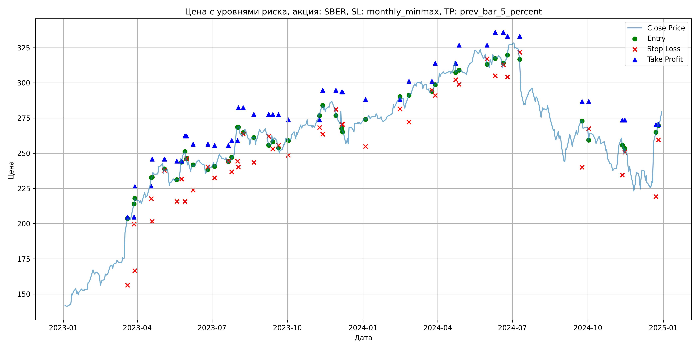
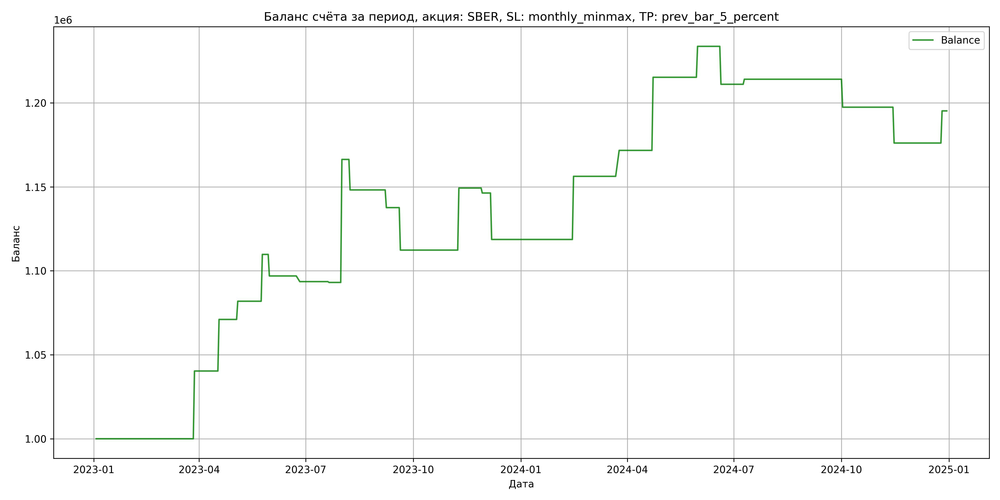

# Результаты торговой стратегии для SBER

**Дата:** 2025-05-17 12:23:37  
**Стратегия:** SBER,_SL_monthly_minmax,_TP_prev_bar_5_percent

## Конфигурация

```json
{
    "TICKER": "SBER",
    "EXCHANGE": "MOEX",
    "START_DATE": "2023-01-01",
    "END_DATE": "2024-12-31",
    "INTERVAL": "1d",
    "CAPITAL": 1000000,
    "RISK_PERCENT": 0.02,
    "PROFIT_TO_RISK": 3,
    "ATR_MULTIPLIER": 1.5,
    "ATR_WINDOW": 14,
    "STOP_LOSS_METHOD": "monthly_minmax",
    "TAKE_PROFIT_METHOD": "prev_bar_5_percent",
    "POSITION": "long"
}
```

## Метрики эффективности

- **Начальный баланс:** 1000000.00
- **Конечный баланс:** 1195212.40
- **Прибыль/Убыток:** 195212.40 (19.52% за период тестирования)
- **Количество сделок:** 23
- **Процент выигрышных сделок:** 52.17% (12 выигрышных, 11 убыточных)
- **Средняя прибыль:** 29756.24
- **Средний убыток:** -14714.77
- **Максимальная прибыль:** 73241.28
- **Максимальный убыток:** -27650.40
- **Коэффициент прибыли:** 2.21
- **Максимальная просадка:** -4.67%

## Графики

### График цены с уровнями риска



### График баланса счёта



## Завершённые сделки

**Всего сделок:** 46

| Сделка № | Дата | Тип | Покупка / продажа | Количество акций | Цена | Stop Loss в момент сделки | Take Profit в момент сделки | Прибыль / убыток | Прибыль / убыток с учётом комиссии |
|:--------:|:----:|:---:|:-----------------:|:----------------:|:----:|:-------------------------:|:---------------------------:|:----------------:|:----------------------------------:|
| 1 | 2023-03-20 00:00:00 | LONG | BUY | 2395 | 196.02 | 156.25 | 204.61 | 0.00 | -234.73 |
| 2 | 2023-03-28 00:00:00 | LONG | SELL | -2395 | 212.86 | 199.66 | 204.61 | 40331.80 | 39842.17 |
| 3 | 2023-03-29 00:00:00 | LONG | BUY | 2355 | 214.85 | 166.55 | 226.21 | 0.00 | -252.99 |
| 4 | 2023-04-18 00:00:00 | LONG | SELL | -2355 | 227.89 | 217.77 | 226.21 | 30709.20 | 30187.87 |
| 5 | 2023-04-19 00:00:00 | LONG | BUY | 2568 | 232.67 | 201.59 | 245.90 | 0.00 | -298.75 |
| 6 | 2023-05-04 00:00:00 | LONG | SELL | -2568 | 236.89 | 237.77 | 245.90 | 10836.96 | 10234.04 |
| 7 | 2023-05-19 00:00:00 | LONG | BUY | 1845 | 230.99 | 215.70 | 244.44 | 0.00 | -213.09 |
| 8 | 2023-05-25 00:00:00 | LONG | SELL | -1845 | 246.10 | 231.70 | 244.44 | 27877.95 | 27437.83 |
| 9 | 2023-05-29 00:00:00 | LONG | BUY | 2219 | 249.78 | 215.70 | 262.22 | 0.00 | -277.13 |
| 10 | 2023-05-31 00:00:00 | LONG | SELL | -2219 | 244.00 | 246.16 | 262.22 | -12825.82 | -13373.67 |
| 11 | 2023-06-08 00:00:00 | LONG | BUY | 1983 | 241.30 | 223.94 | 256.51 | 0.00 | -239.25 |
| 12 | 2023-06-26 00:00:00 | LONG | SELL | -1983 | 239.60 | 240.28 | 256.51 | -3371.10 | -3847.91 |
| 13 | 2023-07-04 00:00:00 | LONG | BUY | 2225 | 243.40 | 232.54 | 255.50 | 0.00 | -270.78 |
| 14 | 2023-07-21 00:00:00 | LONG | SELL | -2225 | 243.18 | 244.41 | 255.50 | -489.50 | -1030.82 |
| 15 | 2023-07-25 00:00:00 | LONG | BUY | 3114 | 245.48 | 236.80 | 258.95 | 0.00 | -382.21 |
| 16 | 2023-08-01 00:00:00 | LONG | SELL | -3114 | 269.00 | 244.26 | 258.95 | 73241.28 | 72440.23 |
| 17 | 2023-08-02 00:00:00 | LONG | BUY | 2759 | 268.50 | 240.24 | 282.39 | 0.00 | -370.40 |
| 18 | 2023-08-08 00:00:00 | LONG | SELL | -2759 | 261.92 | 263.73 | 282.39 | -18154.22 | -18885.93 |
| 19 | 2023-08-21 00:00:00 | LONG | BUY | 2417 | 262.44 | 243.52 | 277.66 | 0.00 | -317.16 |
| 20 | 2023-09-08 00:00:00 | LONG | SELL | -2417 | 258.08 | 262.04 | 277.66 | -10538.12 | -11167.17 |
| 21 | 2023-09-13 00:00:00 | LONG | BUY | 2635 | 262.40 | 253.10 | 277.49 | 0.00 | -345.71 |
| 22 | 2023-09-20 00:00:00 | LONG | SELL | -2635 | 252.80 | 255.61 | 277.49 | -25296.00 | -25974.78 |
| 23 | 2023-10-02 00:00:00 | LONG | BUY | 2145 | 261.37 | 248.62 | 273.76 | 0.00 | -280.32 |
| 24 | 2023-11-09 00:00:00 | LONG | SELL | -2145 | 278.60 | 268.26 | 273.76 | 36958.35 | 36379.23 |
| 25 | 2023-11-13 00:00:00 | LONG | BUY | 2853 | 280.40 | 263.51 | 294.69 | 0.00 | -399.99 |
| 26 | 2023-11-29 00:00:00 | LONG | SELL | -2853 | 279.36 | 281.11 | 294.69 | -2967.12 | -3765.62 |
| 27 | 2023-12-06 00:00:00 | LONG | BUY | 2248 | 279.92 | 270.52 | 293.60 | 0.00 | -314.63 |
| 28 | 2023-12-07 00:00:00 | LONG | SELL | -2248 | 267.62 | 270.52 | 293.60 | -27650.40 | -28265.83 |
| 29 | 2024-01-04 00:00:00 | LONG | BUY | 2569 | 274.67 | 254.81 | 288.29 | 0.00 | -352.81 |
| 30 | 2024-02-15 00:00:00 | LONG | SELL | -2569 | 289.30 | 281.53 | 288.29 | 37584.47 | 36860.05 |
| 31 | 2024-02-26 00:00:00 | LONG | BUY | 2819 | 288.52 | 272.21 | 301.14 | 0.00 | -406.67 |
| 32 | 2024-03-25 00:00:00 | LONG | SELL | -2819 | 294.00 | 294.88 | 301.14 | 15448.12 | 14627.06 |
| 33 | 2024-03-29 00:00:00 | LONG | BUY | 2719 | 299.38 | 291.05 | 313.95 | 0.00 | -407.01 |
| 34 | 2024-04-23 00:00:00 | LONG | SELL | -2719 | 315.39 | 302.12 | 313.95 | 43531.19 | 42695.41 |
| 35 | 2024-04-27 00:00:00 | LONG | BUY | 2728 | 309.25 | 298.95 | 326.77 | 0.00 | -421.82 |
| 36 | 2024-05-31 00:00:00 | LONG | SELL | -2728 | 316.00 | 317.07 | 326.77 | 18414.00 | 17561.16 |
| 37 | 2024-06-10 00:00:00 | LONG | BUY | 2236 | 320.80 | 305.00 | 335.89 | 0.00 | -358.65 |
| 38 | 2024-06-20 00:00:00 | LONG | SELL | -2236 | 310.70 | 312.96 | 335.89 | -22583.60 | -23289.62 |
| 39 | 2024-06-25 00:00:00 | LONG | BUY | 2001 | 317.50 | 304.14 | 333.11 | 0.00 | -317.66 |
| 40 | 2024-07-10 00:00:00 | LONG | SELL | -2001 | 319.00 | 321.80 | 333.11 | 3001.50 | 2364.68 |
| 41 | 2024-09-24 00:00:00 | LONG | BUY | 2110 | 273.90 | 240.01 | 286.69 | 0.00 | -288.96 |
| 42 | 2024-10-02 00:00:00 | LONG | SELL | -2110 | 266.01 | 267.46 | 286.69 | -16647.90 | -17217.51 |
| 43 | 2024-11-12 00:00:00 | LONG | BUY | 1998 | 259.99 | 234.57 | 273.64 | 0.00 | -259.73 |
| 44 | 2024-11-15 00:00:00 | LONG | SELL | -1998 | 249.31 | 250.65 | 273.64 | -21338.64 | -21847.43 |
| 45 | 2024-12-23 00:00:00 | LONG | BUY | 1595 | 260.00 | 219.20 | 270.35 | 0.00 | -207.35 |
| 46 | 2024-12-26 00:00:00 | LONG | SELL | -1595 | 272.00 | 259.60 | 270.35 | 19140.00 | 18715.73 |
