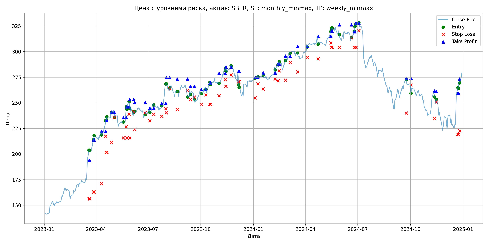
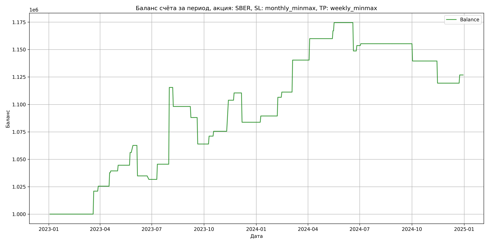

# Результаты торговой стратегии для SBER

**Дата:** 2025-05-17 12:23:38  
**Стратегия:** SBER,_SL_monthly_minmax,_TP_weekly_minmax

## Конфигурация

```json
{
    "TICKER": "SBER",
    "EXCHANGE": "MOEX",
    "START_DATE": "2023-01-01",
    "END_DATE": "2024-12-31",
    "INTERVAL": "1d",
    "CAPITAL": 1000000,
    "RISK_PERCENT": 0.02,
    "PROFIT_TO_RISK": 3,
    "ATR_MULTIPLIER": 1.5,
    "ATR_WINDOW": 14,
    "STOP_LOSS_METHOD": "monthly_minmax",
    "TAKE_PROFIT_METHOD": "weekly_minmax",
    "POSITION": "long"
}
```

## Метрики эффективности

- **Начальный баланс:** 1000000.00
- **Конечный баланс:** 1126824.46
- **Прибыль/Убыток:** 126824.46 (12.68% за период тестирования)
- **Количество сделок:** 32
- **Процент выигрышных сделок:** 71.88% (23 выигрышных, 9 убыточных)
- **Средняя прибыль:** 12950.29
- **Средний убыток:** -19003.58
- **Максимальная прибыль:** 69948.48
- **Максимальный убыток:** -27803.84
- **Коэффициент прибыли:** 1.74
- **Максимальная просадка:** -4.70%

## Графики

### График цены с уровнями риска



### График баланса счёта



## Завершённые сделки

**Всего сделок:** 65

| Сделка № | Дата | Тип | Покупка / продажа | Количество акций | Цена | Stop Loss в момент сделки | Take Profit в момент сделки | Прибыль / убыток | Прибыль / убыток с учётом комиссии |
|:--------:|:----:|:---:|:-----------------:|:----------------:|:----:|:-------------------------:|:---------------------------:|:----------------:|:----------------------------------:|
| 1 | 2023-03-20 00:00:00 | LONG | BUY | 2395 | 196.02 | 156.25 | 193.69 | 0.00 | -234.73 |
| 2 | 2023-03-21 00:00:00 | LONG | SELL | -2395 | 204.76 | 156.25 | 193.69 | 20932.30 | 20452.37 |
| 3 | 2023-03-28 00:00:00 | LONG | BUY | 2278 | 212.86 | 162.96 | 213.78 | 0.00 | -242.45 |
| 4 | 2023-03-29 00:00:00 | LONG | SELL | -2278 | 214.85 | 162.96 | 213.78 | 4533.22 | 4046.06 |
| 5 | 2023-04-11 00:00:00 | LONG | BUY | 2464 | 222.90 | 171.01 | 222.28 | 0.00 | -274.61 |
| 6 | 2023-04-18 00:00:00 | LONG | SELL | -2464 | 227.89 | 217.43 | 222.28 | 12295.36 | 11739.99 |
| 7 | 2023-04-19 00:00:00 | LONG | BUY | 2487 | 232.67 | 201.59 | 232.80 | 0.00 | -289.33 |
| 8 | 2023-04-20 00:00:00 | LONG | SELL | -2487 | 233.32 | 201.59 | 232.80 | 1616.55 | 1037.09 |
| 9 | 2023-04-28 00:00:00 | LONG | BUY | 2655 | 240.90 | 211.30 | 240.85 | 0.00 | -319.79 |
| 10 | 2023-05-03 00:00:00 | LONG | SELL | -2655 | 242.85 | 235.57 | 240.85 | 5177.25 | 4535.07 |
| 11 | 2023-05-19 00:00:00 | LONG | BUY | 1779 | 230.99 | 215.70 | 235.54 | 0.00 | -205.47 |
| 12 | 2023-05-24 00:00:00 | LONG | SELL | -1779 | 237.49 | 226.64 | 235.54 | 11563.50 | 11146.79 |
| 13 | 2023-05-25 00:00:00 | LONG | BUY | 1770 | 246.10 | 215.70 | 246.15 | 0.00 | -217.80 |
| 14 | 2023-05-29 00:00:00 | LONG | SELL | -1770 | 249.78 | 238.88 | 246.15 | 6513.60 | 6074.75 |
| 15 | 2023-05-30 00:00:00 | LONG | BUY | 2152 | 248.84 | 215.70 | 253.19 | 0.00 | -267.75 |
| 16 | 2023-06-06 00:00:00 | LONG | SELL | -2152 | 235.92 | 241.25 | 253.19 | -27803.84 | -28325.44 |
| 17 | 2023-06-08 00:00:00 | LONG | BUY | 1868 | 241.30 | 223.94 | 250.34 | 0.00 | -225.37 |
| 18 | 2023-06-26 00:00:00 | LONG | SELL | -1868 | 239.60 | 240.28 | 250.34 | -3175.60 | -3624.76 |
| 19 | 2023-07-04 00:00:00 | LONG | BUY | 2095 | 243.40 | 232.54 | 244.87 | 0.00 | -254.96 |
| 20 | 2023-07-11 00:00:00 | LONG | SELL | -2095 | 250.01 | 238.80 | 244.87 | 13847.95 | 13331.10 |
| 21 | 2023-07-25 00:00:00 | LONG | BUY | 2974 | 245.48 | 236.80 | 249.51 | 0.00 | -365.03 |
| 22 | 2023-08-01 00:00:00 | LONG | SELL | -2974 | 269.00 | 244.26 | 249.51 | 69948.48 | 69183.45 |
| 23 | 2023-08-02 00:00:00 | LONG | BUY | 2635 | 268.50 | 240.24 | 274.77 | 0.00 | -353.75 |
| 24 | 2023-08-08 00:00:00 | LONG | SELL | -2635 | 261.92 | 263.73 | 274.77 | -17338.30 | -18037.13 |
| 25 | 2023-08-21 00:00:00 | LONG | BUY | 2308 | 262.44 | 243.52 | 273.20 | 0.00 | -302.86 |
| 26 | 2023-09-08 00:00:00 | LONG | SELL | -2308 | 258.08 | 262.04 | 273.20 | -10062.88 | -10663.56 |
| 27 | 2023-09-13 00:00:00 | LONG | BUY | 2517 | 262.40 | 253.10 | 266.09 | 0.00 | -330.23 |
| 28 | 2023-09-20 00:00:00 | LONG | SELL | -2517 | 252.80 | 255.61 | 266.09 | -24163.20 | -24811.58 |
| 29 | 2023-10-02 00:00:00 | LONG | BUY | 2048 | 261.37 | 248.62 | 263.06 | 0.00 | -267.64 |
| 30 | 2023-10-10 00:00:00 | LONG | SELL | -2048 | 264.89 | 257.67 | 263.06 | 7208.96 | 6670.07 |
| 31 | 2023-10-17 00:00:00 | LONG | BUY | 2592 | 268.30 | 248.62 | 269.46 | 0.00 | -347.72 |
| 32 | 2023-10-18 00:00:00 | LONG | SELL | -2592 | 270.00 | 248.62 | 269.46 | 4406.40 | 3708.76 |
| 33 | 2023-11-02 00:00:00 | LONG | BUY | 2723 | 270.00 | 257.00 | 278.76 | 0.00 | -367.60 |
| 34 | 2023-11-13 00:00:00 | LONG | SELL | -2723 | 280.40 | 272.59 | 278.76 | 28319.20 | 27569.83 |
| 35 | 2023-11-14 00:00:00 | LONG | BUY | 2696 | 283.70 | 266.11 | 285.04 | 0.00 | -382.43 |
| 36 | 2023-11-23 00:00:00 | LONG | SELL | -2696 | 286.16 | 277.25 | 285.04 | 6632.16 | 5863.99 |
| 37 | 2023-12-06 00:00:00 | LONG | BUY | 2172 | 279.92 | 270.52 | 280.80 | 0.00 | -303.99 |
| 38 | 2023-12-07 00:00:00 | LONG | SELL | -2172 | 267.62 | 270.52 | 280.80 | -26715.60 | -27310.23 |
| 39 | 2024-01-04 00:00:00 | LONG | BUY | 2482 | 274.67 | 254.81 | 274.74 | 0.00 | -340.87 |
| 40 | 2024-01-09 00:00:00 | LONG | SELL | -2482 | 276.97 | 268.64 | 274.74 | 5708.60 | 5024.01 |
| 41 | 2024-01-18 00:00:00 | LONG | BUY | 2713 | 278.24 | 263.50 | 279.32 | 0.00 | -377.43 |
| 42 | 2024-02-08 00:00:00 | LONG | SELL | -2713 | 284.52 | 273.10 | 279.32 | 17037.64 | 16274.26 |
| 43 | 2024-02-13 00:00:00 | LONG | BUY | 2665 | 287.52 | 271.55 | 288.00 | 0.00 | -383.12 |
| 44 | 2024-02-15 00:00:00 | LONG | SELL | -2665 | 289.30 | 281.33 | 288.00 | 4743.70 | 3975.09 |
| 45 | 2024-02-26 00:00:00 | LONG | BUY | 2698 | 288.52 | 272.21 | 295.59 | 0.00 | -389.21 |
| 46 | 2024-03-05 00:00:00 | LONG | SELL | -2698 | 299.33 | 289.47 | 295.59 | 29165.38 | 28372.37 |
| 47 | 2024-03-18 00:00:00 | LONG | BUY | 2642 | 299.40 | 280.20 | 304.98 | 0.00 | -395.51 |
| 48 | 2024-04-04 00:00:00 | LONG | SELL | -2642 | 306.80 | 294.42 | 304.98 | 19550.80 | 18750.01 |
| 49 | 2024-04-23 00:00:00 | LONG | BUY | 2544 | 315.39 | 293.04 | 315.00 | 0.00 | -401.18 |
| 50 | 2024-05-15 00:00:00 | LONG | SELL | -2544 | 318.20 | 308.55 | 315.00 | 7148.64 | 6342.71 |
| 51 | 2024-05-16 00:00:00 | LONG | BUY | 2520 | 320.00 | 304.34 | 320.24 | 0.00 | -403.20 |
| 52 | 2024-05-17 00:00:00 | LONG | SELL | -2520 | 322.96 | 304.34 | 320.24 | 7459.20 | 6649.07 |
| 53 | 2024-05-30 00:00:00 | LONG | BUY | 2530 | 320.91 | 304.34 | 326.27 | 0.00 | -405.95 |
| 54 | 2024-06-20 00:00:00 | LONG | SELL | -2530 | 310.70 | 313.50 | 326.27 | -25831.30 | -26630.29 |
| 55 | 2024-06-25 00:00:00 | LONG | BUY | 1889 | 317.50 | 304.14 | 319.44 | 0.00 | -299.88 |
| 56 | 2024-06-26 00:00:00 | LONG | SELL | -1889 | 320.10 | 304.14 | 319.44 | 4911.40 | 4309.19 |
| 57 | 2024-06-28 00:00:00 | LONG | BUY | 2362 | 327.87 | 304.14 | 328.03 | 0.00 | -387.21 |
| 58 | 2024-07-03 00:00:00 | LONG | SELL | -2362 | 328.58 | 320.61 | 328.03 | 1677.02 | 901.75 |
| 59 | 2024-09-24 00:00:00 | LONG | BUY | 1997 | 273.90 | 240.01 | 273.95 | 0.00 | -273.49 |
| 60 | 2024-10-02 00:00:00 | LONG | SELL | -1997 | 266.01 | 267.46 | 273.95 | -15756.33 | -16295.43 |
| 61 | 2024-11-12 00:00:00 | LONG | BUY | 1890 | 259.99 | 234.57 | 261.44 | 0.00 | -245.69 |
| 62 | 2024-11-15 00:00:00 | LONG | SELL | -1890 | 249.31 | 250.65 | 261.44 | -20185.20 | -20666.49 |
| 63 | 2024-12-23 00:00:00 | LONG | BUY | 1510 | 260.00 | 219.20 | 259.31 | 0.00 | -196.30 |
| 64 | 2024-12-24 00:00:00 | LONG | SELL | -1510 | 264.94 | 219.20 | 259.31 | 7459.40 | 7063.07 |
| 65 | 2024-12-26 00:00:00 | LONG | BUY | 1432 | 272.00 | 222.48 | 273.31 | 0.00 | -194.75 |
