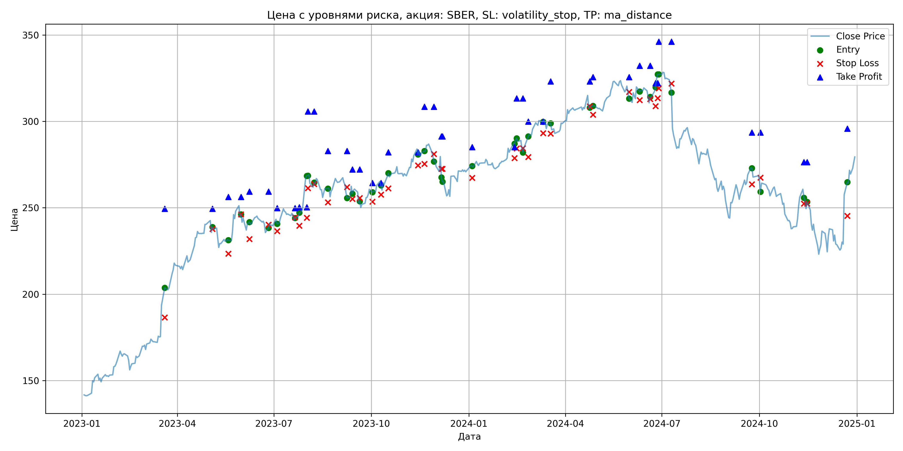
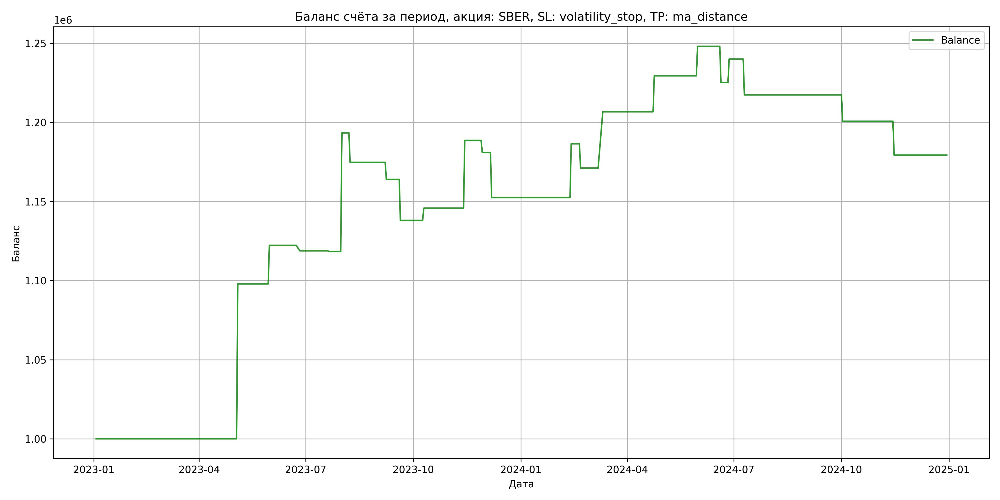

# Результаты торговой стратегии для SBER

**Дата:** 2025-05-17 12:23:32  
**Стратегия:** SBER,_SL_volatility_stop,_TP_ma_distance

## Конфигурация

```json
{
    "TICKER": "SBER",
    "EXCHANGE": "MOEX",
    "START_DATE": "2023-01-01",
    "END_DATE": "2024-12-31",
    "INTERVAL": "1d",
    "CAPITAL": 1000000,
    "RISK_PERCENT": 0.02,
    "PROFIT_TO_RISK": 3,
    "ATR_MULTIPLIER": 1.5,
    "ATR_WINDOW": 14,
    "STOP_LOSS_METHOD": "volatility_stop",
    "TAKE_PROFIT_METHOD": "ma_distance",
    "POSITION": "long"
}
```

## Метрики эффективности

- **Начальный баланс:** 1000000.00
- **Конечный баланс:** 1179334.95
- **Прибыль/Убыток:** 179334.95 (17.93% за период тестирования)
- **Количество сделок:** 22
- **Процент выигрышных сделок:** 45.45% (10 выигрышных, 12 убыточных)
- **Средняя прибыль:** 37370.03
- **Средний убыток:** -16197.11
- **Максимальная прибыль:** 97883.65
- **Максимальный убыток:** -28511.40
- **Коэффициент прибыли:** 1.92
- **Максимальная просадка:** -5.51%

## Графики

### График цены с уровнями риска



### График баланса счёта



## Завершённые сделки

**Всего сделок:** 45

| Сделка № | Дата | Тип | Покупка / продажа | Количество акций | Цена | Stop Loss в момент сделки | Take Profit в момент сделки | Прибыль / убыток | Прибыль / убыток с учётом комиссии |
|:--------:|:----:|:---:|:-----------------:|:----------------:|:----:|:-------------------------:|:---------------------------:|:----------------:|:----------------------------------:|
| 1 | 2023-03-20 00:00:00 | LONG | BUY | 2395 | 196.02 | 186.58 | 249.50 | 0.00 | -234.73 |
| 2 | 2023-05-04 00:00:00 | LONG | SELL | -2395 | 236.89 | 237.77 | 249.50 | 97883.65 | 97365.24 |
| 3 | 2023-05-19 00:00:00 | LONG | BUY | 1874 | 230.99 | 223.50 | 256.32 | 0.00 | -216.44 |
| 4 | 2023-05-31 00:00:00 | LONG | SELL | -1874 | 244.00 | 246.16 | 256.32 | 24380.74 | 23935.67 |
| 5 | 2023-06-08 00:00:00 | LONG | BUY | 2032 | 241.30 | 231.98 | 259.43 | 0.00 | -245.16 |
| 6 | 2023-06-26 00:00:00 | LONG | SELL | -2032 | 239.60 | 240.28 | 259.43 | -3454.40 | -3942.99 |
| 7 | 2023-07-04 00:00:00 | LONG | BUY | 2280 | 243.40 | 236.47 | 249.83 | 0.00 | -277.48 |
| 8 | 2023-07-21 00:00:00 | LONG | SELL | -2280 | 243.18 | 244.41 | 249.83 | -501.60 | -1056.30 |
| 9 | 2023-07-25 00:00:00 | LONG | BUY | 3191 | 245.48 | 239.60 | 250.29 | 0.00 | -391.66 |
| 10 | 2023-08-01 00:00:00 | LONG | SELL | -3191 | 269.00 | 244.26 | 250.29 | 75052.32 | 74231.47 |
| 11 | 2023-08-02 00:00:00 | LONG | BUY | 2827 | 268.50 | 261.43 | 305.70 | 0.00 | -379.52 |
| 12 | 2023-08-08 00:00:00 | LONG | SELL | -2827 | 261.92 | 263.73 | 305.70 | -18601.66 | -19351.41 |
| 13 | 2023-08-21 00:00:00 | LONG | BUY | 2477 | 262.44 | 253.20 | 282.81 | 0.00 | -325.03 |
| 14 | 2023-09-08 00:00:00 | LONG | SELL | -2477 | 258.08 | 262.04 | 282.81 | -10799.72 | -11444.38 |
| 15 | 2023-09-13 00:00:00 | LONG | BUY | 2700 | 262.40 | 255.19 | 272.16 | 0.00 | -354.24 |
| 16 | 2023-09-20 00:00:00 | LONG | SELL | -2700 | 252.80 | 255.61 | 272.16 | -25920.00 | -26615.52 |
| 17 | 2023-10-02 00:00:00 | LONG | BUY | 2198 | 261.37 | 253.50 | 264.41 | 0.00 | -287.25 |
| 18 | 2023-10-10 00:00:00 | LONG | SELL | -2198 | 264.89 | 257.67 | 264.41 | 7736.96 | 7158.60 |
| 19 | 2023-10-17 00:00:00 | LONG | BUY | 2781 | 268.30 | 261.26 | 282.10 | 0.00 | -373.07 |
| 20 | 2023-11-14 00:00:00 | LONG | SELL | -2781 | 283.70 | 274.59 | 282.10 | 42827.40 | 42059.84 |
| 21 | 2023-11-20 00:00:00 | LONG | BUY | 2939 | 281.96 | 275.35 | 308.48 | 0.00 | -414.34 |
| 22 | 2023-11-29 00:00:00 | LONG | SELL | -2939 | 279.36 | 281.11 | 308.48 | -7641.40 | -8466.26 |
| 23 | 2023-12-06 00:00:00 | LONG | BUY | 2318 | 279.92 | 272.53 | 291.26 | 0.00 | -324.43 |
| 24 | 2023-12-07 00:00:00 | LONG | SELL | -2318 | 267.62 | 272.53 | 291.26 | -28511.40 | -29146.00 |
| 25 | 2024-01-04 00:00:00 | LONG | BUY | 2649 | 274.67 | 267.30 | 285.10 | 0.00 | -363.80 |
| 26 | 2024-02-13 00:00:00 | LONG | SELL | -2649 | 287.52 | 278.72 | 285.10 | 34039.65 | 33295.03 |
| 27 | 2024-02-15 00:00:00 | LONG | BUY | 2852 | 289.30 | 284.29 | 313.24 | 0.00 | -412.54 |
| 28 | 2024-02-21 00:00:00 | LONG | SELL | -2852 | 283.90 | 284.44 | 313.24 | -15400.80 | -16218.18 |
| 29 | 2024-02-26 00:00:00 | LONG | BUY | 2855 | 288.52 | 279.38 | 299.88 | 0.00 | -411.86 |
| 30 | 2024-03-11 00:00:00 | LONG | SELL | -2855 | 301.00 | 293.19 | 299.88 | 35630.40 | 34788.86 |
| 31 | 2024-03-18 00:00:00 | LONG | BUY | 2807 | 299.40 | 292.93 | 323.05 | 0.00 | -420.21 |
| 32 | 2024-04-24 00:00:00 | LONG | SELL | -2807 | 307.50 | 308.69 | 323.05 | 22736.70 | 21884.92 |
| 33 | 2024-04-27 00:00:00 | LONG | BUY | 2760 | 309.25 | 303.85 | 325.60 | 0.00 | -426.77 |
| 34 | 2024-05-31 00:00:00 | LONG | SELL | -2760 | 316.00 | 317.07 | 325.60 | 18630.00 | 17767.15 |
| 35 | 2024-06-10 00:00:00 | LONG | BUY | 2262 | 320.80 | 312.25 | 332.16 | 0.00 | -362.82 |
| 36 | 2024-06-20 00:00:00 | LONG | SELL | -2262 | 310.70 | 312.96 | 332.16 | -22846.20 | -23560.43 |
| 37 | 2024-06-25 00:00:00 | LONG | BUY | 2025 | 317.50 | 308.87 | 322.07 | 0.00 | -321.47 |
| 38 | 2024-06-27 00:00:00 | LONG | SELL | -2025 | 324.80 | 313.40 | 322.07 | 14782.50 | 14132.17 |
| 39 | 2024-06-28 00:00:00 | LONG | BUY | 2551 | 327.87 | 319.08 | 346.04 | 0.00 | -418.20 |
| 40 | 2024-07-10 00:00:00 | LONG | SELL | -2551 | 319.00 | 321.80 | 346.04 | -22627.37 | -23452.45 |
| 41 | 2024-09-24 00:00:00 | LONG | BUY | 2114 | 273.90 | 263.61 | 293.58 | 0.00 | -289.51 |
| 42 | 2024-10-02 00:00:00 | LONG | SELL | -2114 | 266.01 | 267.46 | 293.58 | -16679.46 | -17250.14 |
| 43 | 2024-11-12 00:00:00 | LONG | BUY | 2002 | 259.99 | 252.44 | 276.43 | 0.00 | -260.25 |
| 44 | 2024-11-15 00:00:00 | LONG | SELL | -2002 | 249.31 | 252.44 | 276.43 | -21381.36 | -21891.17 |
| 45 | 2024-12-23 00:00:00 | LONG | BUY | 1598 | 260.00 | 245.37 | 295.83 | 0.00 | -207.74 |
