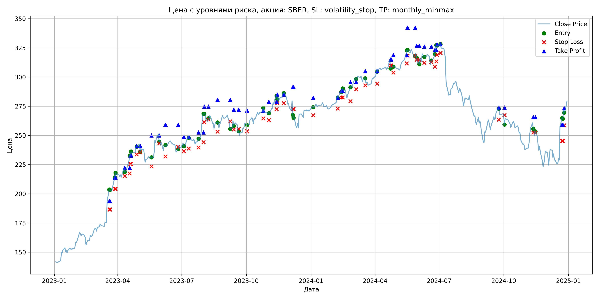
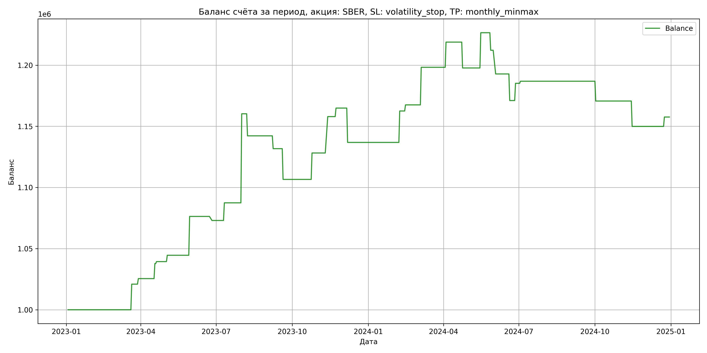

# Результаты торговой стратегии для SBER

**Дата:** 2025-05-17 12:23:31  
**Стратегия:** SBER,_SL_volatility_stop,_TP_monthly_minmax

## Конфигурация

```json
{
    "TICKER": "SBER",
    "EXCHANGE": "MOEX",
    "START_DATE": "2023-01-01",
    "END_DATE": "2024-12-31",
    "INTERVAL": "1d",
    "CAPITAL": 1000000,
    "RISK_PERCENT": 0.02,
    "PROFIT_TO_RISK": 3,
    "ATR_MULTIPLIER": 1.5,
    "ATR_WINDOW": 14,
    "STOP_LOSS_METHOD": "volatility_stop",
    "TAKE_PROFIT_METHOD": "monthly_minmax",
    "POSITION": "long"
}
```

## Метрики эффективности

- **Начальный баланс:** 1000000.00
- **Конечный баланс:** 1157577.09
- **Прибыль/Убыток:** 157577.09 (15.76% за период тестирования)
- **Количество сделок:** 30
- **Процент выигрышных сделок:** 63.33% (19 выигрышных, 11 убыточных)
- **Средняя прибыль:** 18745.90
- **Средний убыток:** -18054.09
- **Максимальная прибыль:** 72817.92
- **Максимальный убыток:** -28080.90
- **Коэффициент прибыли:** 1.79
- **Максимальная просадка:** -6.25%

## Графики

### График цены с уровнями риска



### График баланса счёта



## Завершённые сделки

**Всего сделок:** 61

| Сделка № | Дата | Тип | Покупка / продажа | Количество акций | Цена | Stop Loss в момент сделки | Take Profit в момент сделки | Прибыль / убыток | Прибыль / убыток с учётом комиссии |
|:--------:|:----:|:---:|:-----------------:|:----------------:|:----:|:-------------------------:|:---------------------------:|:----------------:|:----------------------------------:|
| 1 | 2023-03-20 00:00:00 | LONG | BUY | 2395 | 196.02 | 186.58 | 193.69 | 0.00 | -234.73 |
| 2 | 2023-03-21 00:00:00 | LONG | SELL | -2395 | 204.76 | 186.58 | 193.69 | 20932.30 | 20452.37 |
| 3 | 2023-03-28 00:00:00 | LONG | BUY | 2278 | 212.86 | 204.32 | 213.78 | 0.00 | -242.45 |
| 4 | 2023-03-29 00:00:00 | LONG | SELL | -2278 | 214.85 | 204.32 | 213.78 | 4533.22 | 4046.06 |
| 5 | 2023-04-11 00:00:00 | LONG | BUY | 2464 | 222.90 | 215.23 | 222.28 | 0.00 | -274.61 |
| 6 | 2023-04-18 00:00:00 | LONG | SELL | -2464 | 227.89 | 217.43 | 222.28 | 12295.36 | 11739.99 |
| 7 | 2023-04-19 00:00:00 | LONG | BUY | 2487 | 232.67 | 225.66 | 232.80 | 0.00 | -289.33 |
| 8 | 2023-04-20 00:00:00 | LONG | SELL | -2487 | 233.32 | 225.66 | 232.80 | 1616.55 | 1037.09 |
| 9 | 2023-04-28 00:00:00 | LONG | BUY | 2655 | 240.90 | 233.82 | 240.85 | 0.00 | -319.79 |
| 10 | 2023-05-03 00:00:00 | LONG | SELL | -2655 | 242.85 | 235.57 | 240.85 | 5177.25 | 4535.07 |
| 11 | 2023-05-19 00:00:00 | LONG | BUY | 1779 | 230.99 | 223.50 | 249.99 | 0.00 | -205.47 |
| 12 | 2023-05-30 00:00:00 | LONG | SELL | -1779 | 248.84 | 243.14 | 249.99 | 31755.15 | 31328.34 |
| 13 | 2023-06-08 00:00:00 | LONG | BUY | 1945 | 241.30 | 231.98 | 259.18 | 0.00 | -234.66 |
| 14 | 2023-06-26 00:00:00 | LONG | SELL | -1945 | 239.60 | 240.28 | 259.18 | -3306.50 | -3774.18 |
| 15 | 2023-07-04 00:00:00 | LONG | BUY | 2182 | 243.40 | 236.47 | 248.77 | 0.00 | -265.55 |
| 16 | 2023-07-11 00:00:00 | LONG | SELL | -2182 | 250.01 | 238.80 | 248.77 | 14423.02 | 13884.71 |
| 17 | 2023-07-25 00:00:00 | LONG | BUY | 3096 | 245.48 | 239.60 | 252.53 | 0.00 | -380.00 |
| 18 | 2023-08-01 00:00:00 | LONG | SELL | -3096 | 269.00 | 244.26 | 252.53 | 72817.92 | 72021.50 |
| 19 | 2023-08-02 00:00:00 | LONG | BUY | 2743 | 268.50 | 261.43 | 274.77 | 0.00 | -368.25 |
| 20 | 2023-08-08 00:00:00 | LONG | SELL | -2743 | 261.92 | 263.73 | 274.77 | -18048.94 | -18776.41 |
| 21 | 2023-08-21 00:00:00 | LONG | BUY | 2403 | 262.44 | 253.20 | 280.45 | 0.00 | -315.32 |
| 22 | 2023-09-08 00:00:00 | LONG | SELL | -2403 | 258.08 | 262.04 | 280.45 | -10477.08 | -11102.48 |
| 23 | 2023-09-13 00:00:00 | LONG | BUY | 2620 | 262.40 | 255.19 | 272.05 | 0.00 | -343.74 |
| 24 | 2023-09-20 00:00:00 | LONG | SELL | -2620 | 252.80 | 255.61 | 272.05 | -25152.00 | -25826.91 |
| 25 | 2023-10-02 00:00:00 | LONG | BUY | 2133 | 261.37 | 253.50 | 271.21 | 0.00 | -278.75 |
| 26 | 2023-10-25 00:00:00 | LONG | SELL | -2133 | 271.50 | 264.70 | 271.21 | 21607.29 | 21038.98 |
| 27 | 2023-11-02 00:00:00 | LONG | BUY | 2862 | 270.00 | 263.10 | 278.76 | 0.00 | -386.37 |
| 28 | 2023-11-13 00:00:00 | LONG | SELL | -2862 | 280.40 | 272.59 | 278.76 | 29764.80 | 28977.18 |
| 29 | 2023-11-14 00:00:00 | LONG | BUY | 2833 | 283.70 | 277.74 | 285.04 | 0.00 | -401.86 |
| 30 | 2023-11-23 00:00:00 | LONG | SELL | -2833 | 286.16 | 277.74 | 285.04 | 6969.18 | 6161.97 |
| 31 | 2023-12-06 00:00:00 | LONG | BUY | 2283 | 279.92 | 272.53 | 291.35 | 0.00 | -319.53 |
| 32 | 2023-12-07 00:00:00 | LONG | SELL | -2283 | 267.62 | 272.53 | 291.35 | -28080.90 | -28705.92 |
| 33 | 2024-01-04 00:00:00 | LONG | BUY | 2608 | 274.67 | 267.30 | 282.35 | 0.00 | -358.17 |
| 34 | 2024-02-08 00:00:00 | LONG | SELL | -2608 | 284.52 | 273.10 | 282.35 | 25688.80 | 24959.62 |
| 35 | 2024-02-13 00:00:00 | LONG | BUY | 2807 | 287.52 | 282.63 | 288.00 | 0.00 | -403.53 |
| 36 | 2024-02-15 00:00:00 | LONG | SELL | -2807 | 289.30 | 282.63 | 288.00 | 4996.46 | 4186.89 |
| 37 | 2024-02-26 00:00:00 | LONG | BUY | 2842 | 288.52 | 279.38 | 295.59 | 0.00 | -409.99 |
| 38 | 2024-03-05 00:00:00 | LONG | SELL | -2842 | 299.33 | 289.47 | 295.59 | 30722.02 | 29886.69 |
| 39 | 2024-03-18 00:00:00 | LONG | BUY | 2783 | 299.40 | 292.93 | 304.98 | 0.00 | -416.62 |
| 40 | 2024-04-04 00:00:00 | LONG | SELL | -2783 | 306.80 | 294.42 | 304.98 | 20594.20 | 19750.67 |
| 41 | 2024-04-23 00:00:00 | LONG | BUY | 2679 | 315.39 | 310.05 | 315.00 | 0.00 | -422.46 |
| 42 | 2024-04-24 00:00:00 | LONG | SELL | -2679 | 307.50 | 310.05 | 315.00 | -21137.31 | -21971.67 |
| 43 | 2024-04-27 00:00:00 | LONG | BUY | 2681 | 309.25 | 303.85 | 318.76 | 0.00 | -414.55 |
| 44 | 2024-05-16 00:00:00 | LONG | SELL | -2681 | 320.00 | 311.76 | 318.76 | 28820.75 | 27977.24 |
| 45 | 2024-05-17 00:00:00 | LONG | BUY | 2626 | 322.96 | 318.31 | 342.28 | 0.00 | -424.05 |
| 46 | 2024-05-28 00:00:00 | LONG | SELL | -2626 | 317.50 | 318.31 | 342.28 | -14337.96 | -15178.88 |
| 47 | 2024-05-30 00:00:00 | LONG | BUY | 2614 | 320.91 | 314.76 | 326.81 | 0.00 | -419.43 |
| 48 | 2024-06-03 00:00:00 | LONG | SELL | -2614 | 313.50 | 314.76 | 326.81 | -19369.74 | -20198.91 |
| 49 | 2024-06-10 00:00:00 | LONG | BUY | 2152 | 320.80 | 312.25 | 326.09 | 0.00 | -345.18 |
| 50 | 2024-06-20 00:00:00 | LONG | SELL | -2152 | 310.70 | 312.96 | 326.09 | -21735.20 | -22414.69 |
| 51 | 2024-06-25 00:00:00 | LONG | BUY | 1927 | 317.50 | 308.87 | 323.16 | 0.00 | -305.91 |
| 52 | 2024-06-27 00:00:00 | LONG | SELL | -1927 | 324.80 | 313.40 | 323.16 | 14067.10 | 13448.24 |
| 53 | 2024-06-28 00:00:00 | LONG | BUY | 2428 | 327.87 | 319.08 | 328.03 | 0.00 | -398.03 |
| 54 | 2024-07-03 00:00:00 | LONG | SELL | -2428 | 328.58 | 320.61 | 328.03 | 1723.88 | 926.95 |
| 55 | 2024-09-24 00:00:00 | LONG | BUY | 2053 | 273.90 | 263.61 | 273.95 | 0.00 | -281.16 |
| 56 | 2024-10-02 00:00:00 | LONG | SELL | -2053 | 266.01 | 267.46 | 273.95 | -16198.17 | -16752.39 |
| 57 | 2024-11-12 00:00:00 | LONG | BUY | 1943 | 259.99 | 252.44 | 265.67 | 0.00 | -252.58 |
| 58 | 2024-11-15 00:00:00 | LONG | SELL | -1943 | 249.31 | 252.44 | 265.67 | -20751.24 | -21246.02 |
| 59 | 2024-12-23 00:00:00 | LONG | BUY | 1552 | 260.00 | 245.37 | 259.31 | 0.00 | -201.76 |
| 60 | 2024-12-24 00:00:00 | LONG | SELL | -1552 | 264.94 | 245.37 | 259.31 | 7666.88 | 7259.53 |
| 61 | 2024-12-26 00:00:00 | LONG | BUY | 1473 | 272.00 | 258.72 | 273.31 | 0.00 | -200.33 |
