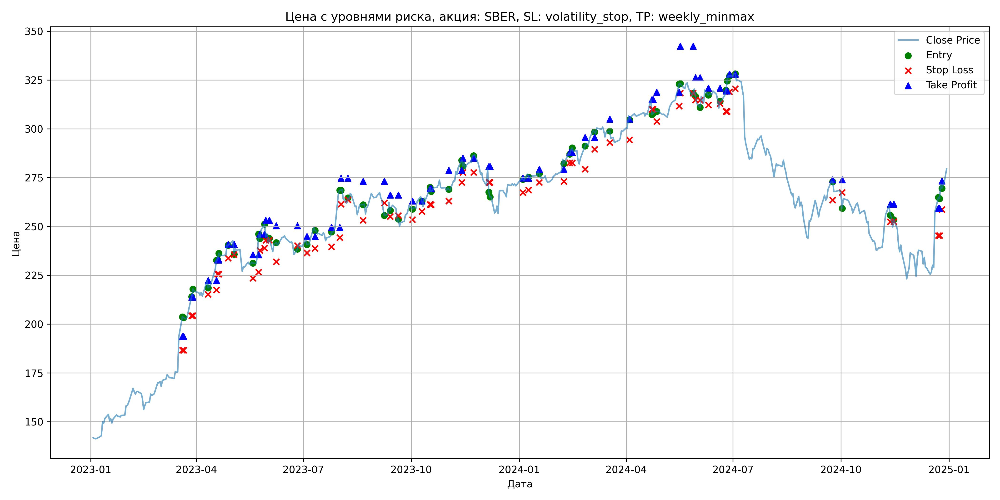

# Результаты торговой стратегии для SBER

**Дата:** 2025-05-17 12:23:30  
**Стратегия:** SBER,_SL_volatility_stop,_TP_weekly_minmax

## Конфигурация

```json
{
    "TICKER": "SBER",
    "EXCHANGE": "MOEX",
    "START_DATE": "2023-01-01",
    "END_DATE": "2024-12-31",
    "INTERVAL": "1d",
    "CAPITAL": 1000000,
    "RISK_PERCENT": 0.02,
    "PROFIT_TO_RISK": 3,
    "ATR_MULTIPLIER": 1.5,
    "ATR_WINDOW": 14,
    "STOP_LOSS_METHOD": "volatility_stop",
    "TAKE_PROFIT_METHOD": "weekly_minmax",
    "POSITION": "long"
}
```

## Метрики эффективности

- **Начальный баланс:** 1000000.00
- **Конечный баланс:** 1107185.25
- **Прибыль/Убыток:** 107185.25 (10.72% за период тестирования)
- **Количество сделок:** 34
- **Процент выигрышных сделок:** 64.71% (22 выигрышных, 12 убыточных)
- **Средняя прибыль:** 14241.18
- **Средний убыток:** -17176.73
- **Максимальная прибыль:** 70818.72
- **Максимальный убыток:** -27060.00
- **Коэффициент прибыли:** 1.52
- **Максимальная просадка:** -6.95%

## Графики

### График цены с уровнями риска



### График баланса счёта


## Завершённые сделки

**Всего сделок:** 69

| Сделка № | Дата | Тип | Покупка / продажа | Количество акций | Цена | Stop Loss в момент сделки | Take Profit в момент сделки | Прибыль / убыток | Прибыль / убыток с учётом комиссии |
|:--------:|:----:|:---:|:-----------------:|:----------------:|:----:|:-------------------------:|:---------------------------:|:----------------:|:----------------------------------:|
| 1 | 2023-03-20 00:00:00 | LONG | BUY | 2395 | 196.02 | 186.58 | 193.69 | 0.00 | -234.73 |
| 2 | 2023-03-21 00:00:00 | LONG | SELL | -2395 | 204.76 | 186.58 | 193.69 | 20932.30 | 20452.37 |
| 3 | 2023-03-28 00:00:00 | LONG | BUY | 2278 | 212.86 | 204.32 | 213.78 | 0.00 | -242.45 |
| 4 | 2023-03-29 00:00:00 | LONG | SELL | -2278 | 214.85 | 204.32 | 213.78 | 4533.22 | 4046.06 |
| 5 | 2023-04-11 00:00:00 | LONG | BUY | 2464 | 222.90 | 215.23 | 222.28 | 0.00 | -274.61 |
| 6 | 2023-04-18 00:00:00 | LONG | SELL | -2464 | 227.89 | 217.43 | 222.28 | 12295.36 | 11739.99 |
| 7 | 2023-04-19 00:00:00 | LONG | BUY | 2487 | 232.67 | 225.66 | 232.80 | 0.00 | -289.33 |
| 8 | 2023-04-20 00:00:00 | LONG | SELL | -2487 | 233.32 | 225.66 | 232.80 | 1616.55 | 1037.09 |
| 9 | 2023-04-28 00:00:00 | LONG | BUY | 2655 | 240.90 | 233.82 | 240.85 | 0.00 | -319.79 |
| 10 | 2023-05-03 00:00:00 | LONG | SELL | -2655 | 242.85 | 235.57 | 240.85 | 5177.25 | 4535.07 |
| 11 | 2023-05-19 00:00:00 | LONG | BUY | 1779 | 230.99 | 223.50 | 235.54 | 0.00 | -205.47 |
| 12 | 2023-05-24 00:00:00 | LONG | SELL | -1779 | 237.49 | 226.64 | 235.54 | 11563.50 | 11146.79 |
| 13 | 2023-05-25 00:00:00 | LONG | BUY | 1770 | 246.10 | 237.73 | 246.15 | 0.00 | -217.80 |
| 14 | 2023-05-29 00:00:00 | LONG | SELL | -1770 | 249.78 | 238.88 | 246.15 | 6513.60 | 6074.75 |
| 15 | 2023-05-30 00:00:00 | LONG | BUY | 2152 | 248.84 | 242.91 | 253.19 | 0.00 | -267.75 |
| 16 | 2023-06-02 00:00:00 | LONG | SELL | -2152 | 242.00 | 242.91 | 253.19 | -14719.68 | -15247.82 |
| 17 | 2023-06-08 00:00:00 | LONG | BUY | 1892 | 241.30 | 231.98 | 250.34 | 0.00 | -228.27 |
| 18 | 2023-06-26 00:00:00 | LONG | SELL | -1892 | 239.60 | 240.28 | 250.34 | -3216.40 | -3671.33 |
| 19 | 2023-07-04 00:00:00 | LONG | BUY | 2122 | 243.40 | 236.47 | 244.87 | 0.00 | -258.25 |
| 20 | 2023-07-11 00:00:00 | LONG | SELL | -2122 | 250.01 | 238.80 | 244.87 | 14026.42 | 13502.91 |
| 21 | 2023-07-25 00:00:00 | LONG | BUY | 3011 | 245.48 | 239.60 | 249.51 | 0.00 | -369.57 |
| 22 | 2023-08-01 00:00:00 | LONG | SELL | -3011 | 269.00 | 244.26 | 249.51 | 70818.72 | 70044.17 |
| 23 | 2023-08-02 00:00:00 | LONG | BUY | 2668 | 268.50 | 261.43 | 274.77 | 0.00 | -358.18 |
| 24 | 2023-08-08 00:00:00 | LONG | SELL | -2668 | 261.92 | 263.73 | 274.77 | -17555.44 | -18263.02 |
| 25 | 2023-08-21 00:00:00 | LONG | BUY | 2337 | 262.44 | 253.20 | 273.20 | 0.00 | -306.66 |
| 26 | 2023-09-08 00:00:00 | LONG | SELL | -2337 | 258.08 | 262.04 | 273.20 | -10189.32 | -10797.55 |
| 27 | 2023-09-13 00:00:00 | LONG | BUY | 2549 | 262.40 | 255.19 | 266.09 | 0.00 | -334.43 |
| 28 | 2023-09-20 00:00:00 | LONG | SELL | -2549 | 252.80 | 255.61 | 266.09 | -24470.40 | -25127.02 |
| 29 | 2023-10-02 00:00:00 | LONG | BUY | 2074 | 261.37 | 253.50 | 263.06 | 0.00 | -271.04 |
| 30 | 2023-10-10 00:00:00 | LONG | SELL | -2074 | 264.89 | 257.67 | 263.06 | 7300.48 | 6754.75 |
| 31 | 2023-10-17 00:00:00 | LONG | BUY | 2625 | 268.30 | 261.26 | 269.46 | 0.00 | -352.14 |
| 32 | 2023-10-18 00:00:00 | LONG | SELL | -2625 | 270.00 | 261.26 | 269.46 | 4462.50 | 3755.98 |
| 33 | 2023-11-02 00:00:00 | LONG | BUY | 2758 | 270.00 | 263.10 | 278.76 | 0.00 | -372.33 |
| 34 | 2023-11-13 00:00:00 | LONG | SELL | -2758 | 280.40 | 272.59 | 278.76 | 28683.20 | 27924.20 |
| 35 | 2023-11-14 00:00:00 | LONG | BUY | 2731 | 283.70 | 277.74 | 285.04 | 0.00 | -387.39 |
| 36 | 2023-11-23 00:00:00 | LONG | SELL | -2731 | 286.16 | 277.74 | 285.04 | 6718.26 | 5940.12 |
| 37 | 2023-12-06 00:00:00 | LONG | BUY | 2200 | 279.92 | 272.53 | 280.80 | 0.00 | -307.91 |
| 38 | 2023-12-07 00:00:00 | LONG | SELL | -2200 | 267.62 | 272.53 | 280.80 | -27060.00 | -27662.29 |
| 39 | 2024-01-04 00:00:00 | LONG | BUY | 2514 | 274.67 | 267.30 | 274.74 | 0.00 | -345.26 |
| 40 | 2024-01-09 00:00:00 | LONG | SELL | -2514 | 276.97 | 268.64 | 274.74 | 5782.20 | 5088.79 |
| 41 | 2024-01-18 00:00:00 | LONG | BUY | 2747 | 278.24 | 272.52 | 279.32 | 0.00 | -382.16 |
| 42 | 2024-02-08 00:00:00 | LONG | SELL | -2747 | 284.52 | 273.10 | 279.32 | 17251.16 | 16478.21 |
| 43 | 2024-02-13 00:00:00 | LONG | BUY | 2699 | 287.52 | 282.63 | 288.00 | 0.00 | -388.01 |
| 44 | 2024-02-15 00:00:00 | LONG | SELL | -2699 | 289.30 | 282.63 | 288.00 | 4804.22 | 4025.80 |
| 45 | 2024-02-26 00:00:00 | LONG | BUY | 2732 | 288.52 | 279.38 | 295.59 | 0.00 | -394.12 |
| 46 | 2024-03-05 00:00:00 | LONG | SELL | -2732 | 299.33 | 289.47 | 295.59 | 29532.92 | 28729.92 |
| 47 | 2024-03-18 00:00:00 | LONG | BUY | 2676 | 299.40 | 292.93 | 304.98 | 0.00 | -400.60 |
| 48 | 2024-04-04 00:00:00 | LONG | SELL | -2676 | 306.80 | 294.42 | 304.98 | 19802.40 | 18991.30 |
| 49 | 2024-04-23 00:00:00 | LONG | BUY | 2576 | 315.39 | 310.05 | 315.00 | 0.00 | -406.22 |
| 50 | 2024-04-24 00:00:00 | LONG | SELL | -2576 | 307.50 | 310.05 | 315.00 | -20324.64 | -21126.92 |
| 51 | 2024-04-27 00:00:00 | LONG | BUY | 2578 | 309.25 | 303.85 | 318.76 | 0.00 | -398.62 |
| 52 | 2024-05-16 00:00:00 | LONG | SELL | -2578 | 320.00 | 311.76 | 318.76 | 27713.50 | 26902.40 |
| 53 | 2024-05-17 00:00:00 | LONG | BUY | 2526 | 322.96 | 318.31 | 342.28 | 0.00 | -407.90 |
| 54 | 2024-05-28 00:00:00 | LONG | SELL | -2526 | 317.50 | 318.31 | 342.28 | -13791.96 | -14600.86 |
| 55 | 2024-05-30 00:00:00 | LONG | BUY | 2514 | 320.91 | 314.76 | 326.27 | 0.00 | -403.38 |
| 56 | 2024-06-03 00:00:00 | LONG | SELL | -2514 | 313.50 | 314.76 | 326.27 | -18628.74 | -19426.19 |
| 57 | 2024-06-10 00:00:00 | LONG | BUY | 2070 | 320.80 | 312.25 | 320.82 | 0.00 | -332.03 |
| 58 | 2024-06-20 00:00:00 | LONG | SELL | -2070 | 310.70 | 312.96 | 320.82 | -20907.00 | -21560.60 |
| 59 | 2024-06-25 00:00:00 | LONG | BUY | 1853 | 317.50 | 308.87 | 319.44 | 0.00 | -294.16 |
| 60 | 2024-06-26 00:00:00 | LONG | SELL | -1853 | 320.10 | 308.87 | 319.44 | 4817.80 | 4227.06 |
| 61 | 2024-06-28 00:00:00 | LONG | BUY | 2316 | 327.87 | 319.08 | 328.03 | 0.00 | -379.67 |
| 62 | 2024-07-03 00:00:00 | LONG | SELL | -2316 | 328.58 | 320.61 | 328.03 | 1644.36 | 884.19 |
| 63 | 2024-09-24 00:00:00 | LONG | BUY | 1959 | 273.90 | 263.61 | 273.95 | 0.00 | -268.29 |
| 64 | 2024-10-02 00:00:00 | LONG | SELL | -1959 | 266.01 | 267.46 | 273.95 | -15456.51 | -15985.35 |
| 65 | 2024-11-12 00:00:00 | LONG | BUY | 1854 | 259.99 | 252.44 | 261.44 | 0.00 | -241.01 |
| 66 | 2024-11-15 00:00:00 | LONG | SELL | -1854 | 249.31 | 252.44 | 261.44 | -19800.72 | -20272.84 |
| 67 | 2024-12-23 00:00:00 | LONG | BUY | 1481 | 260.00 | 245.37 | 259.31 | 0.00 | -192.53 |
| 68 | 2024-12-24 00:00:00 | LONG | SELL | -1481 | 264.94 | 245.37 | 259.31 | 7316.14 | 6927.42 |
| 69 | 2024-12-26 00:00:00 | LONG | BUY | 1405 | 272.00 | 258.72 | 273.31 | 0.00 | -191.08 |
