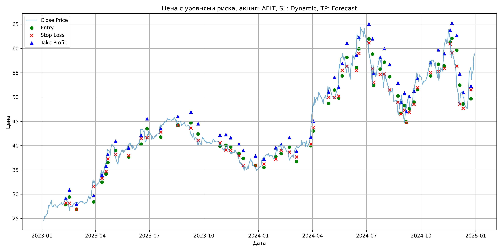
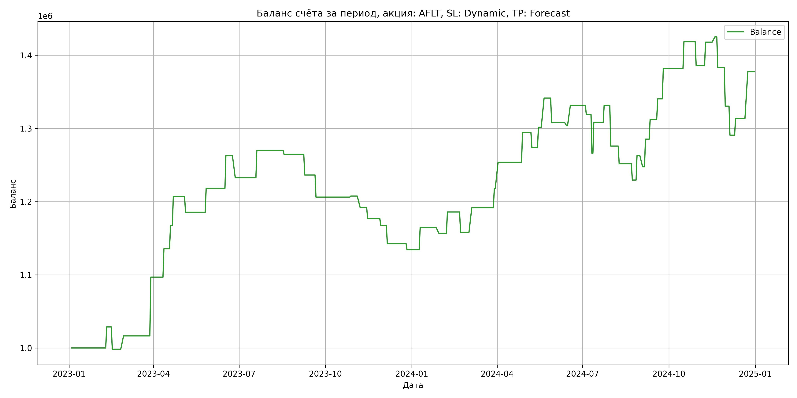

# Результаты торговой стратегии для AFLT

**Дата:** 2025-05-18 18:37:26  
**Стратегия:** AFLT,_SL_Dynamic,_TP_Forecast

## Конфигурация

```json
{
    "TICKER": "AFLT",
    "EXCHANGE": "MOEX",
    "START_DATE": "2023-01-01",
    "END_DATE": "2024-12-31",
    "INTERVAL": "1d",
    "CAPITAL": 1000000,
    "RISK_PERCENT": 0.02,
    "PROFIT_TO_RISK": 3,
    "ATR_MULTIPLIER": 1.5,
    "ATR_WINDOW": 14,
    "STOP_LOSS_METHOD": "Dynamic",
    "TAKE_PROFIT_METHOD": "Forecast"
}
```

## Метрики эффективности

- **Начальный баланс:** 1000000.00
- **Конечный баланс:** 1377501.51
- **Прибыль/Убыток:** 377501.51 (37.75% за период тестирования)
- **Количество сделок:** 57
- **Процент выигрышных сделок:** 54.39% (31 выигрышных, 26 убыточных)
- **Средняя прибыль:** 33580.15
- **Средний убыток:** -25518.59
- **Максимальная прибыль:** 80262.17
- **Максимальный убыток:** -55720.06
- **Коэффициент прибыли:** 1.57
- **Максимальная просадка:** -10.68%

## Графики

### График цены с уровнями риска



### График баланса счёта



## Завершённые сделки

**Всего сделок:** 57

| Сделка № | Дата | Тип | Покупка / продажа | Количество акций | Цена | Stop Loss в момент сделки | Take Profit в момент сделки | Прибыль / убыток | Прибыль / убыток с учётом комиссии |
|:--------:|:----:|:---:|:-----------------:|:----------------:|:----:|:-------------------------:|:---------------------------:|:----------------:|:----------------------------------:|
| 1 | 2023-02-09 23:59:59 | long | buy | 0 | 0.00 | 28.18 | 29.19 | 28747.54 | 28265.71 |
| 2 | 2023-02-15 23:59:59 | long | buy | 0 | 0.00 | 28.16 | 30.87 | -30471.14 | -30936.23 |
| 3 | 2023-02-27 23:59:59 | long | buy | 0 | 0.00 | 26.92 | 27.98 | 18251.63 | 17772.25 |
| 4 | 2023-03-28 23:59:59 | long | buy | 0 | 0.00 | 31.62 | 29.74 | 80262.17 | 79746.68 |
| 5 | 2023-04-11 23:59:59 | long | buy | 0 | 0.00 | 33.26 | 33.98 | 38721.65 | 38189.61 |
| 6 | 2023-04-18 23:59:59 | long | buy | 0 | 0.00 | 34.69 | 35.78 | 31952.17 | 31405.86 |
| 7 | 2023-04-21 23:59:59 | long | buy | 0 | 0.00 | 37.29 | 38.18 | 39668.96 | 39103.54 |
| 8 | 2023-05-04 23:59:59 | long | buy | 0 | 0.00 | 38.17 | 40.92 | -21711.25 | -22262.30 |
| 9 | 2023-05-26 23:59:59 | long | buy | 0 | 0.00 | 37.94 | 39.53 | 32666.27 | 32113.18 |
| 10 | 2023-06-16 23:59:59 | long | buy | 0 | 0.00 | 41.49 | 42.16 | 44653.62 | 44063.08 |
| 11 | 2023-06-26 23:59:59 | long | buy | 0 | 0.00 | 41.65 | 45.55 | -30094.06 | -30667.21 |
| 12 | 2023-07-19 23:59:59 | long | buy | 0 | 0.00 | 42.78 | 43.49 | 37231.29 | 36635.76 |
| 13 | 2023-08-17 23:59:59 | long | buy | 0 | 0.00 | 44.22 | 45.98 | -5359.88 | -5952.91 |
| 14 | 2023-09-08 23:59:59 | long | buy | 0 | 0.00 | 43.60 | 46.94 | -28188.97 | -28761.62 |
| 15 | 2023-09-20 23:59:59 | long | buy | 0 | 0.00 | 41.05 | 44.52 | -30159.13 | -30717.43 |
| 16 | 2023-10-27 23:59:59 | long | buy | 0 | 0.00 | 40.60 | 42.15 | 1392.98 | 836.04 |
| 17 | 2023-11-06 23:59:59 | long | buy | 0 | 0.00 | 39.09 | 42.27 | -15425.12 | -15974.36 |
| 18 | 2023-11-14 23:59:59 | long | buy | 0 | 0.00 | 39.01 | 41.62 | -15294.66 | -15840.25 |
| 19 | 2023-11-28 23:59:59 | long | buy | 0 | 0.00 | 37.95 | 40.30 | -9310.54 | -9851.00 |
| 20 | 2023-12-05 23:59:59 | long | buy | 0 | 0.00 | 35.87 | 39.01 | -25044.53 | -25575.43 |
| 21 | 2023-12-26 23:59:59 | long | buy | 0 | 0.00 | 35.91 | 37.86 | -8220.41 | -8742.84 |
| 22 | 2024-01-09 23:59:59 | long | buy | 0 | 0.00 | 36.22 | 37.24 | 30384.97 | 29845.29 |
| 23 | 2024-01-29 23:59:59 | long | buy | 0 | 0.00 | 37.23 | 39.57 | -8102.21 | -8636.76 |
| 24 | 2024-02-07 23:59:59 | long | buy | 0 | 0.00 | 39.05 | 40.21 | 29288.35 | 28739.03 |
| 25 | 2024-02-21 23:59:59 | long | buy | 0 | 0.00 | 38.68 | 41.65 | -27694.23 | -28228.22 |
| 26 | 2024-03-04 23:59:59 | long | buy | 0 | 0.00 | 37.68 | 38.86 | 33529.72 | 32982.63 |
| 27 | 2024-03-28 23:59:59 | long | buy | 0 | 0.00 | 40.32 | 41.77 | 26358.63 | 25793.03 |
| 28 | 2024-04-01 23:59:59 | long | buy | 0 | 0.00 | 43.69 | 45.08 | 35724.88 | 35144.54 |
| 29 | 2024-04-27 23:59:59 | long | buy | 0 | 0.00 | 49.97 | 51.06 | 40752.26 | 40153.15 |
| 30 | 2024-05-07 23:59:59 | long | buy | 0 | 0.00 | 49.91 | 54.03 | -20767.69 | -21353.77 |
| 31 | 2024-05-14 23:59:59 | long | buy | 0 | 0.00 | 50.18 | 52.05 | 27910.00 | 27306.73 |
| 32 | 2024-05-20 23:59:59 | long | buy | 0 | 0.00 | 55.51 | 56.90 | 39797.87 | 39176.81 |
| 33 | 2024-05-28 23:59:59 | long | buy | 0 | 0.00 | 56.31 | 61.08 | -33589.49 | -34190.28 |
| 34 | 2024-06-13 23:59:59 | long | buy | 0 | 0.00 | 55.42 | 58.61 | -4115.43 | -4717.71 |
| 35 | 2024-06-17 23:59:59 | long | buy | 0 | 0.00 | 58.97 | 62.29 | 27859.86 | 27269.64 |
| 36 | 2024-07-04 23:59:59 | long | buy | 0 | 0.00 | 61.16 | 65.06 | -12715.48 | -13304.82 |
| 37 | 2024-07-10 23:59:59 | long | buy | 0 | 0.00 | 55.80 | 61.99 | -52895.98 | -53473.67 |
| 38 | 2024-07-12 23:59:59 | long | buy | 0 | 0.00 | 53.00 | 54.95 | 42275.80 | 41733.62 |
| 39 | 2024-07-23 23:59:59 | long | buy | 0 | 0.00 | 54.65 | 58.17 | 23348.60 | 22795.87 |
| 40 | 2024-07-30 23:59:59 | long | buy | 0 | 0.00 | 54.75 | 59.98 | -55720.06 | -56297.99 |
| 41 | 2024-08-08 23:59:59 | long | buy | 0 | 0.00 | 51.48 | 56.68 | -24116.43 | -24615.56 |
| 42 | 2024-08-22 23:59:59 | long | buy | 0 | 0.00 | 48.92 | 52.91 | -22321.65 | -22805.00 |
| 43 | 2024-08-27 23:59:59 | long | buy | 0 | 0.00 | 46.52 | 48.98 | 33392.38 | 32824.09 |
| 44 | 2024-09-02 23:59:59 | long | buy | 0 | 0.00 | 47.31 | 50.80 | -15273.80 | -15826.17 |
| 45 | 2024-09-05 23:59:59 | long | buy | 0 | 0.00 | 44.80 | 46.99 | 37802.39 | 37325.50 |
| 46 | 2024-09-10 23:59:59 | long | buy | 0 | 0.00 | 46.90 | 50.10 | 26853.79 | 26364.01 |
| 47 | 2024-09-18 23:59:59 | long | buy | 0 | 0.00 | 48.49 | 51.28 | 28208.73 | 27683.11 |
| 48 | 2024-09-24 23:59:59 | long | buy | 0 | 0.00 | 51.91 | 53.83 | 41516.12 | 40905.02 |
| 49 | 2024-10-16 23:59:59 | long | buy | 0 | 0.00 | 55.01 | 57.07 | 36521.79 | 35870.95 |
| 50 | 2024-10-29 23:59:59 | long | buy | 0 | 0.00 | 55.27 | 59.72 | -32651.46 | -33282.95 |
| 51 | 2024-11-08 23:59:59 | long | buy | 0 | 0.00 | 55.90 | 58.92 | 32011.15 | 31358.09 |
| 52 | 2024-11-18 23:59:59 | long | buy | 0 | 0.00 | 60.92 | 63.77 | 7224.45 | 6566.28 |
| 53 | 2024-11-21 23:59:59 | long | buy | 0 | 0.00 | 59.10 | 65.18 | -41658.78 | -42289.17 |
| 54 | 2024-11-29 23:59:59 | long | buy | 0 | 0.00 | 56.36 | 62.69 | -52950.60 | -53555.39 |
| 55 | 2024-12-04 23:59:59 | long | buy | 0 | 0.00 | 48.56 | 54.76 | -39630.26 | -40142.05 |
| 56 | 2024-12-10 23:59:59 | long | buy | 0 | 0.00 | 47.69 | 50.95 | 22838.55 | 22363.11 |
| 57 | 2024-12-23 23:59:59 | long | buy | 0 | 0.00 | 51.52 | 52.29 | 63836.22 | 63285.96 |
