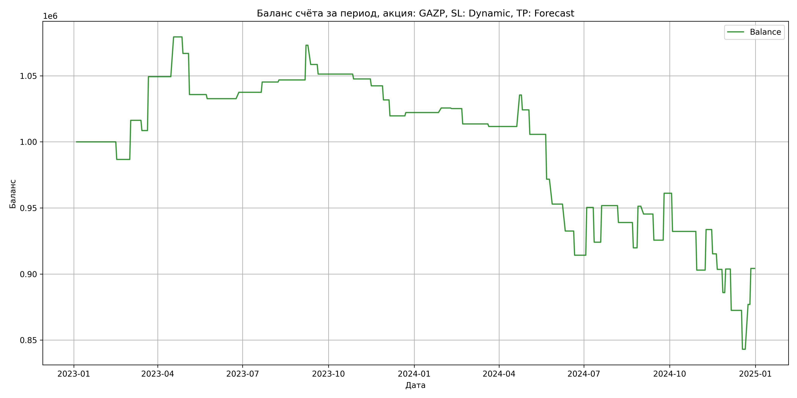

# Результаты торговой стратегии для GAZP

**Дата:** 2025-05-18 18:37:29  
**Стратегия:** GAZP,_SL_Dynamic,_TP_Forecast

## Конфигурация

```json
{
    "TICKER": "GAZP",
    "EXCHANGE": "MOEX",
    "START_DATE": "2023-01-01",
    "END_DATE": "2024-12-31",
    "INTERVAL": "1d",
    "CAPITAL": 1000000,
    "RISK_PERCENT": 0.02,
    "PROFIT_TO_RISK": 3,
    "ATR_MULTIPLIER": 1.5,
    "ATR_WINDOW": 14,
    "STOP_LOSS_METHOD": "Dynamic",
    "TAKE_PROFIT_METHOD": "Forecast"
}
```

## Метрики эффективности

- **Начальный баланс:** 1000000.00
- **Конечный баланс:** 904195.48
- **Прибыль/Убыток:** -95804.52 (-9.58% за период тестирования)
- **Количество сделок:** 50
- **Процент выигрышных сделок:** 36.00% (18 выигрышных, 32 убыточных)
- **Средняя прибыль:** 22847.48
- **Средний убыток:** -15845.60
- **Максимальная прибыль:** 40785.17
- **Максимальный убыток:** -33949.48
- **Коэффициент прибыли:** 0.81
- **Максимальная просадка:** -21.90%

## Графики

### График цены с уровнями риска


### График баланса счёта



## Завершённые сделки

**Всего сделок:** 50

| Сделка № | Дата | Тип | Покупка / продажа | Количество акций | Цена | Stop Loss в момент сделки | Take Profit в момент сделки | Прибыль / убыток | Прибыль / убыток с учётом комиссии |
|:--------:|:----:|:---:|:-----------------:|:----------------:|:----:|:-------------------------:|:---------------------------:|:----------------:|:----------------------------------:|
| 1 | 2023-02-15 23:59:59 | long | buy | 0 | 0.00 | 157.23 | 168.06 | -13310.91 | -13772.00 |
| 2 | 2023-03-02 23:59:59 | long | buy | 0 | 0.00 | 159.82 | 160.74 | 29614.54 | 29136.32 |
| 3 | 2023-03-14 23:59:59 | long | buy | 0 | 0.00 | 159.05 | 168.95 | -7742.98 | -8214.16 |
| 4 | 2023-03-21 23:59:59 | long | buy | 0 | 0.00 | 169.95 | 169.05 | 40785.17 | 40292.34 |
| 5 | 2023-04-17 23:59:59 | long | buy | 0 | 0.00 | 173.79 | 179.08 | 30090.56 | 29587.81 |
| 6 | 2023-04-27 23:59:59 | long | buy | 0 | 0.00 | 178.88 | 191.09 | -12509.12 | -13007.01 |
| 7 | 2023-05-04 23:59:59 | long | buy | 0 | 0.00 | 177.37 | 193.15 | -31113.07 | -31595.71 |
| 8 | 2023-05-23 23:59:59 | long | buy | 0 | 0.00 | 172.60 | 182.34 | -3125.02 | -3605.67 |
| 9 | 2023-06-26 23:59:59 | long | buy | 0 | 0.00 | 166.67 | 174.92 | 4833.03 | 4353.13 |
| 10 | 2023-07-21 23:59:59 | long | buy | 0 | 0.00 | 170.94 | 175.26 | 7767.82 | 7280.35 |
| 11 | 2023-08-08 23:59:59 | long | buy | 0 | 0.00 | 173.02 | 179.75 | 1578.23 | 1091.15 |
| 12 | 2023-09-06 23:59:59 | long | buy | 0 | 0.00 | 178.03 | 181.35 | 26263.93 | 25762.09 |
| 13 | 2023-09-11 23:59:59 | long | buy | 0 | 0.00 | 176.47 | 190.01 | -14549.74 | -15040.94 |
| 14 | 2023-09-19 23:59:59 | long | buy | 0 | 0.00 | 173.17 | 183.37 | -7275.49 | -7764.91 |
| 15 | 2023-10-27 23:59:59 | long | buy | 0 | 0.00 | 168.65 | 177.38 | -3686.05 | -4173.13 |
| 16 | 2023-11-15 23:59:59 | long | buy | 0 | 0.00 | 166.83 | 175.62 | -5203.46 | -5686.73 |
| 17 | 2023-11-28 23:59:59 | long | buy | 0 | 0.00 | 163.28 | 174.78 | -10669.59 | -11146.89 |
| 18 | 2023-12-05 23:59:59 | long | buy | 0 | 0.00 | 161.07 | 172.42 | -12080.33 | -12551.68 |
| 19 | 2023-12-22 23:59:59 | long | buy | 0 | 0.00 | 162.40 | 168.48 | 2520.64 | 2046.36 |
| 20 | 2024-01-29 23:59:59 | long | buy | 0 | 0.00 | 165.14 | 170.19 | 3451.12 | 2975.09 |
| 21 | 2024-02-09 23:59:59 | long | buy | 0 | 0.00 | 163.30 | 171.68 | -454.53 | -928.22 |
| 22 | 2024-02-21 23:59:59 | long | buy | 0 | 0.00 | 160.33 | 171.39 | -11612.35 | -12080.70 |
| 23 | 2024-03-20 23:59:59 | long | buy | 0 | 0.00 | 160.44 | 166.57 | -1942.87 | -2411.24 |
| 24 | 2024-04-22 23:59:59 | long | buy | 0 | 0.00 | 163.61 | 166.34 | 23823.58 | 23343.24 |
| 25 | 2024-04-25 23:59:59 | long | buy | 0 | 0.00 | 163.35 | 175.11 | -11229.63 | -11701.77 |
| 26 | 2024-05-03 23:59:59 | long | buy | 0 | 0.00 | 160.53 | 171.52 | -18533.88 | -18997.74 |
| 27 | 2024-05-21 23:59:59 | long | buy | 0 | 0.00 | 154.15 | 162.96 | -33949.48 | -34396.72 |
| 28 | 2024-05-27 23:59:59 | long | buy | 0 | 0.00 | 134.25 | 146.52 | -18832.04 | -19271.27 |
| 29 | 2024-06-10 23:59:59 | long | buy | 0 | 0.00 | 123.12 | 134.84 | -20387.79 | -20817.66 |
| 30 | 2024-06-20 23:59:59 | long | buy | 0 | 0.00 | 115.69 | 124.95 | -18310.59 | -18731.04 |
| 31 | 2024-07-03 23:59:59 | long | buy | 0 | 0.00 | 120.09 | 121.72 | 36149.50 | 35710.73 |
| 32 | 2024-07-11 23:59:59 | long | buy | 0 | 0.00 | 121.31 | 131.21 | -26292.35 | -26716.39 |
| 33 | 2024-07-19 23:59:59 | long | buy | 0 | 0.00 | 122.72 | 127.84 | 27690.83 | 27251.86 |
| 34 | 2024-08-06 23:59:59 | long | buy | 0 | 0.00 | 130.72 | 137.42 | -12785.71 | -13220.24 |
| 35 | 2024-08-22 23:59:59 | long | buy | 0 | 0.00 | 125.57 | 135.13 | -19180.14 | -19602.18 |
| 36 | 2024-08-27 23:59:59 | long | buy | 0 | 0.00 | 120.67 | 124.44 | 31495.46 | 31058.85 |
| 37 | 2024-09-02 23:59:59 | long | buy | 0 | 0.00 | 123.60 | 130.69 | -5910.40 | -6343.45 |
| 38 | 2024-09-13 23:59:59 | long | buy | 0 | 0.00 | 118.92 | 130.05 | -19762.85 | -20187.61 |
| 39 | 2024-09-24 23:59:59 | long | buy | 0 | 0.00 | 124.51 | 125.91 | 35501.35 | 35057.09 |
| 40 | 2024-10-03 23:59:59 | long | buy | 0 | 0.00 | 133.66 | 146.70 | -28882.94 | -29311.38 |
| 41 | 2024-10-29 23:59:59 | long | buy | 0 | 0.00 | 132.07 | 140.56 | -29299.39 | -29712.15 |
| 42 | 2024-11-08 23:59:59 | long | buy | 0 | 0.00 | 129.24 | 132.27 | 30703.70 | 30274.89 |
| 43 | 2024-11-15 23:59:59 | long | buy | 0 | 0.00 | 132.21 | 142.70 | -18390.80 | -18812.71 |
| 44 | 2024-11-20 23:59:59 | long | buy | 0 | 0.00 | 127.56 | 140.04 | -11765.98 | -12166.23 |
| 45 | 2024-11-26 23:59:59 | long | buy | 0 | 0.00 | 117.73 | 127.98 | -17545.53 | -17950.33 |
| 46 | 2024-11-29 23:59:59 | long | buy | 0 | 0.00 | 113.45 | 120.23 | 17822.91 | 17408.10 |
| 47 | 2024-12-05 23:59:59 | long | buy | 0 | 0.00 | 117.39 | 130.50 | -31286.81 | -31685.83 |
| 48 | 2024-12-17 23:59:59 | long | buy | 0 | 0.00 | 111.19 | 122.46 | -29437.29 | -29820.53 |
| 49 | 2024-12-23 23:59:59 | long | buy | 0 | 0.00 | 108.67 | 112.62 | 33917.43 | 33516.24 |
| 50 | 2024-12-26 23:59:59 | long | buy | 0 | 0.00 | 121.03 | 125.74 | 27244.83 | 26831.31 |
