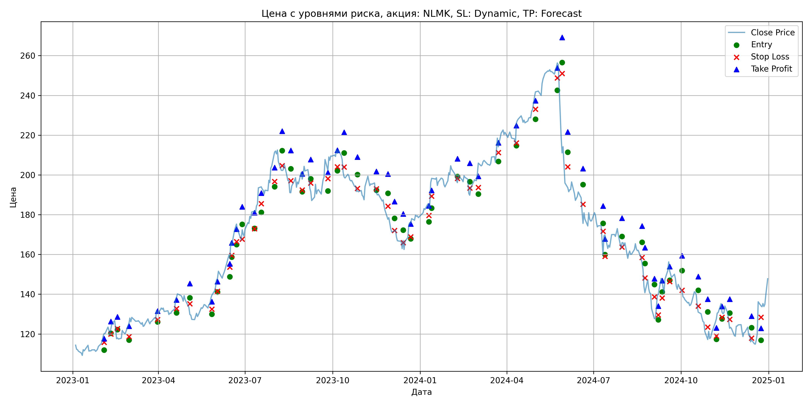
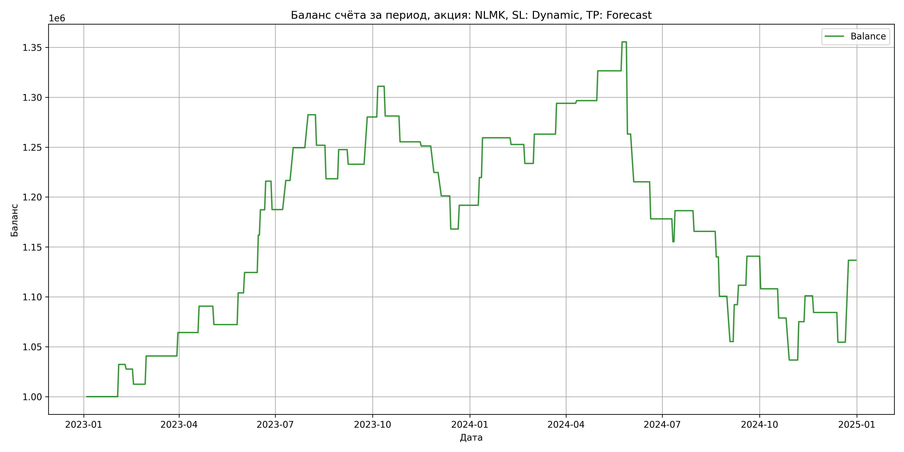

# Результаты торговой стратегии для NLMK

**Дата:** 2025-05-18 18:37:34  
**Стратегия:** NLMK,_SL_Dynamic,_TP_Forecast

## Конфигурация

```json
{
    "TICKER": "NLMK",
    "EXCHANGE": "MOEX",
    "START_DATE": "2023-01-01",
    "END_DATE": "2024-12-31",
    "INTERVAL": "1d",
    "CAPITAL": 1000000,
    "RISK_PERCENT": 0.02,
    "PROFIT_TO_RISK": 3,
    "ATR_MULTIPLIER": 1.5,
    "ATR_WINDOW": 14,
    "STOP_LOSS_METHOD": "Dynamic",
    "TAKE_PROFIT_METHOD": "Forecast"
}
```

## Метрики эффективности

- **Начальный баланс:** 1000000.00
- **Конечный баланс:** 1136646.20
- **Прибыль/Убыток:** 136646.20 (13.66% за период тестирования)
- **Количество сделок:** 58
- **Процент выигрышных сделок:** 51.72% (30 выигрышных, 28 убыточных)
- **Средняя прибыль:** 31095.48
- **Средний убыток:** -28436.37
- **Максимальная прибыль:** 82093.45
- **Максимальный убыток:** -92338.68
- **Коэффициент прибыли:** 1.17
- **Максимальная просадка:** -23.52%

## Графики

### График цены с уровнями риска



### График баланса счёта



## Завершённые сделки

**Всего сделок:** 58

| Сделка № | Дата | Тип | Покупка / продажа | Количество акций | Цена | Stop Loss в момент сделки | Take Profit в момент сделки | Прибыль / убыток | Прибыль / убыток с учётом комиссии |
|:--------:|:----:|:---:|:-----------------:|:----------------:|:----:|:-------------------------:|:---------------------------:|:----------------:|:----------------------------------:|
| 1 | 2023-02-02 23:59:59 | long | buy | 0 | 0.00 | 115.78 | 117.62 | 32272.00 | 31789.67 |
| 2 | 2023-02-09 23:59:59 | long | buy | 0 | 0.00 | 119.95 | 126.23 | -4643.88 | -5123.52 |
| 3 | 2023-02-16 23:59:59 | long | buy | 0 | 0.00 | 122.65 | 128.62 | -15176.40 | -15646.59 |
| 4 | 2023-02-28 23:59:59 | long | buy | 0 | 0.00 | 118.68 | 123.90 | 28301.52 | 27819.62 |
| 5 | 2023-03-30 23:59:59 | long | buy | 0 | 0.00 | 127.23 | 131.46 | 23470.98 | 22970.96 |
| 6 | 2023-04-19 23:59:59 | long | buy | 0 | 0.00 | 132.73 | 137.13 | 26414.97 | 25906.26 |
| 7 | 2023-05-03 23:59:59 | long | buy | 0 | 0.00 | 135.22 | 145.43 | -18435.20 | -18932.48 |
| 8 | 2023-05-26 23:59:59 | long | buy | 0 | 0.00 | 132.46 | 136.29 | 31780.49 | 31265.41 |
| 9 | 2023-06-01 23:59:59 | long | buy | 0 | 0.00 | 141.46 | 146.33 | 20400.14 | 19870.11 |
| 10 | 2023-06-14 23:59:59 | long | buy | 0 | 0.00 | 153.58 | 155.27 | 37431.63 | 36887.17 |
| 11 | 2023-06-16 23:59:59 | long | buy | 0 | 0.00 | 159.56 | 165.88 | 25405.94 | 24850.97 |
| 12 | 2023-06-21 23:59:59 | long | buy | 0 | 0.00 | 166.46 | 172.72 | 28698.01 | 28130.64 |
| 13 | 2023-06-27 23:59:59 | long | buy | 0 | 0.00 | 167.69 | 184.02 | -28478.47 | -29028.47 |
| 14 | 2023-07-10 23:59:59 | long | buy | 0 | 0.00 | 172.97 | 181.02 | 29162.48 | 28594.69 |
| 15 | 2023-07-17 23:59:59 | long | buy | 0 | 0.00 | 185.54 | 190.85 | 32872.63 | 32293.57 |
| 16 | 2023-07-31 23:59:59 | long | buy | 0 | 0.00 | 196.68 | 203.70 | 32983.77 | 32387.84 |
| 17 | 2023-08-08 23:59:59 | long | buy | 0 | 0.00 | 204.67 | 222.01 | -30565.75 | -31147.10 |
| 18 | 2023-08-17 23:59:59 | long | buy | 0 | 0.00 | 197.04 | 212.33 | -33597.01 | -34162.66 |
| 19 | 2023-08-29 23:59:59 | long | buy | 0 | 0.00 | 192.46 | 200.59 | 29245.17 | 28664.97 |
| 20 | 2023-09-07 23:59:59 | long | buy | 0 | 0.00 | 195.87 | 207.80 | -14675.89 | -15246.41 |
| 21 | 2023-09-25 23:59:59 | long | buy | 0 | 0.00 | 198.15 | 201.16 | 47335.19 | 46740.26 |
| 22 | 2023-10-05 23:59:59 | long | buy | 0 | 0.00 | 204.04 | 212.44 | 30796.91 | 30190.16 |
| 23 | 2023-10-12 23:59:59 | long | buy | 0 | 0.00 | 203.97 | 221.42 | -29808.09 | -30399.63 |
| 24 | 2023-10-26 23:59:59 | long | buy | 0 | 0.00 | 193.23 | 208.97 | -25848.76 | -26431.05 |
| 25 | 2023-11-15 23:59:59 | long | buy | 0 | 0.00 | 193.00 | 201.71 | -4173.11 | -4751.17 |
| 26 | 2023-11-27 23:59:59 | long | buy | 0 | 0.00 | 184.30 | 200.49 | -26589.37 | -27153.02 |
| 27 | 2023-12-04 23:59:59 | long | buy | 0 | 0.00 | 172.04 | 186.59 | -23418.75 | -23973.35 |
| 28 | 2023-12-13 23:59:59 | long | buy | 0 | 0.00 | 165.96 | 180.41 | -33232.42 | -33770.86 |
| 29 | 2023-12-21 23:59:59 | long | buy | 0 | 0.00 | 168.85 | 175.35 | 23818.02 | 23265.64 |
| 30 | 2024-01-09 23:59:59 | long | buy | 0 | 0.00 | 179.60 | 184.51 | 27780.49 | 27215.89 |
| 31 | 2024-01-12 23:59:59 | long | buy | 0 | 0.00 | 189.28 | 192.28 | 39846.16 | 39264.42 |
| 32 | 2024-02-08 23:59:59 | long | buy | 0 | 0.00 | 198.24 | 208.17 | -6713.80 | -7292.90 |
| 33 | 2024-02-21 23:59:59 | long | buy | 0 | 0.00 | 193.44 | 205.93 | -18999.22 | -19567.32 |
| 34 | 2024-03-01 23:59:59 | long | buy | 0 | 0.00 | 193.70 | 199.27 | 29369.95 | 28786.26 |
| 35 | 2024-03-22 23:59:59 | long | buy | 0 | 0.00 | 211.20 | 216.22 | 30883.33 | 30284.90 |
| 36 | 2024-04-10 23:59:59 | long | buy | 0 | 0.00 | 216.11 | 224.85 | 2692.58 | 2094.97 |
| 37 | 2024-04-30 23:59:59 | long | buy | 0 | 0.00 | 233.06 | 237.38 | 29861.40 | 29245.62 |
| 38 | 2024-05-23 23:59:59 | long | buy | 0 | 0.00 | 248.77 | 253.83 | 28988.57 | 28362.87 |
| 39 | 2024-05-28 23:59:59 | long | buy | 0 | 0.00 | 250.99 | 269.12 | -92338.68 | -92915.73 |
| 40 | 2024-06-03 23:59:59 | long | buy | 0 | 0.00 | 204.02 | 221.63 | -47870.07 | -48426.25 |
| 41 | 2024-06-19 23:59:59 | long | buy | 0 | 0.00 | 185.24 | 203.24 | -37114.83 | -37633.57 |
| 42 | 2024-07-10 23:59:59 | long | buy | 0 | 0.00 | 171.63 | 184.40 | -22904.86 | -23356.84 |
| 43 | 2024-07-12 23:59:59 | long | buy | 0 | 0.00 | 159.08 | 167.79 | 31111.52 | 30577.05 |
| 44 | 2024-07-30 23:59:59 | long | buy | 0 | 0.00 | 163.75 | 178.31 | -20733.91 | -21263.36 |
| 45 | 2024-08-20 23:59:59 | long | buy | 0 | 0.00 | 158.49 | 174.24 | -25557.25 | -26077.50 |
| 46 | 2024-08-23 23:59:59 | long | buy | 0 | 0.00 | 148.19 | 163.40 | -39523.27 | -40023.49 |
| 47 | 2024-09-02 23:59:59 | long | buy | 0 | 0.00 | 138.72 | 147.78 | -45323.53 | -45817.24 |
| 48 | 2024-09-06 23:59:59 | long | buy | 0 | 0.00 | 129.56 | 134.04 | 36967.16 | 36557.96 |
| 49 | 2024-09-10 23:59:59 | long | buy | 0 | 0.00 | 138.13 | 146.87 | 19448.45 | 18998.22 |
| 50 | 2024-09-18 23:59:59 | long | buy | 0 | 0.00 | 146.34 | 153.95 | 29070.29 | 28581.61 |
| 51 | 2024-10-01 23:59:59 | long | buy | 0 | 0.00 | 141.98 | 159.33 | -32622.24 | -33091.13 |
| 52 | 2024-10-18 23:59:59 | long | buy | 0 | 0.00 | 134.03 | 148.89 | -29277.70 | -29767.66 |
| 53 | 2024-10-28 23:59:59 | long | buy | 0 | 0.00 | 123.49 | 137.53 | -42112.49 | -42582.26 |
| 54 | 2024-11-06 23:59:59 | long | buy | 0 | 0.00 | 118.95 | 123.08 | 38415.05 | 37946.68 |
| 55 | 2024-11-12 23:59:59 | long | buy | 0 | 0.00 | 128.38 | 133.85 | 25946.18 | 25444.73 |
| 56 | 2024-11-20 23:59:59 | long | buy | 0 | 0.00 | 127.38 | 137.53 | -16705.79 | -17195.67 |
| 57 | 2024-12-13 23:59:59 | long | buy | 0 | 0.00 | 117.88 | 129.02 | -29777.52 | -30255.49 |
| 58 | 2024-12-23 23:59:59 | long | buy | 0 | 0.00 | 128.37 | 122.87 | 82093.45 | 81575.28 |
