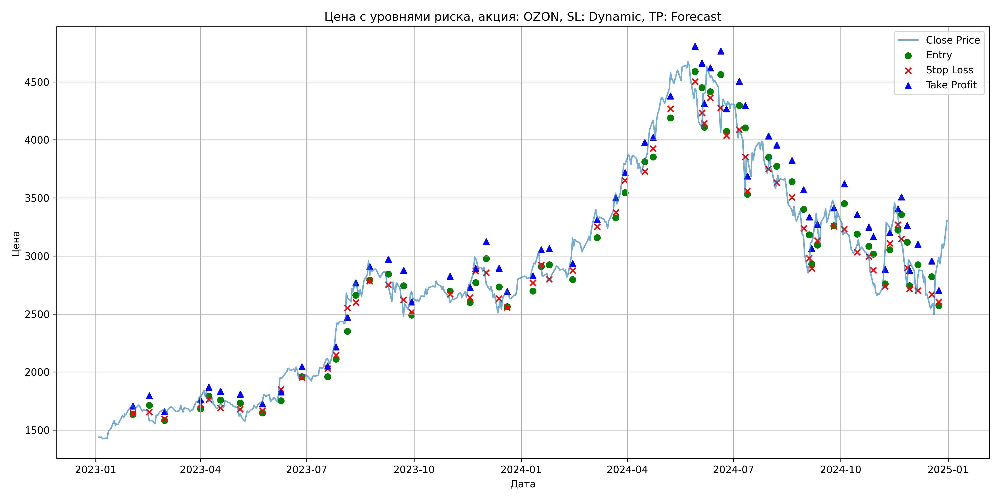
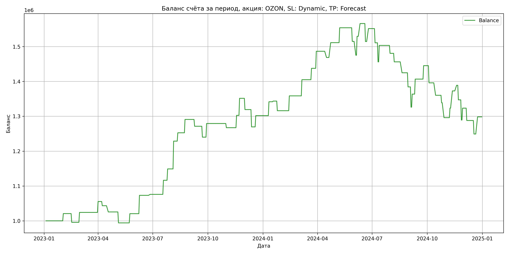

# Результаты торговой стратегии для OZON

**Дата:** 2025-05-18 18:37:23  
**Стратегия:** OZON,_SL_Dynamic,_TP_Forecast

## Конфигурация

```json
{
    "TICKER": "OZON",
    "EXCHANGE": "MOEX",
    "START_DATE": "2023-01-01",
    "END_DATE": "2024-12-31",
    "INTERVAL": "1d",
    "CAPITAL": 1000000,
    "RISK_PERCENT": 0.02,
    "PROFIT_TO_RISK": 3,
    "ATR_MULTIPLIER": 1.5,
    "ATR_WINDOW": 14,
    "STOP_LOSS_METHOD": "Dynamic",
    "TAKE_PROFIT_METHOD": "Forecast"
}
```

## Метрики эффективности

- **Начальный баланс:** 1000000.00
- **Конечный баланс:** 1298352.58
- **Прибыль/Убыток:** 298352.58 (29.84% за период тестирования)
- **Количество сделок:** 64
- **Процент выигрышных сделок:** 54.69% (35 выигрышных, 29 убыточных)
- **Средняя прибыль:** 37169.29
- **Средний убыток:** -34571.47
- **Максимальная прибыль:** 79764.89
- **Максимальный убыток:** -58151.40
- **Коэффициент прибыли:** 1.30
- **Максимальная просадка:** -20.23%

## Графики

### График цены с уровнями риска



### График баланса счёта



## Завершённые сделки

**Всего сделок:** 64

| Сделка № | Дата | Тип | Покупка / продажа | Количество акций | Цена | Stop Loss в момент сделки | Take Profit в момент сделки | Прибыль / убыток | Прибыль / убыток с учётом комиссии |
|:--------:|:----:|:---:|:-----------------:|:----------------:|:----:|:-------------------------:|:---------------------------:|:----------------:|:----------------------------------:|
| 1 | 2023-02-01 23:59:59 | long | buy | 0 | 0.00 | 1643.67 | 1706.25 | 20852.27 | 20372.42 |
| 2 | 2023-02-15 23:59:59 | long | buy | 0 | 0.00 | 1653.56 | 1794.45 | -25113.69 | -25577.54 |
| 3 | 2023-02-28 23:59:59 | long | buy | 0 | 0.00 | 1596.95 | 1657.43 | 28441.56 | 27962.35 |
| 4 | 2023-03-31 23:59:59 | long | buy | 0 | 0.00 | 1721.00 | 1759.80 | 31247.53 | 30754.31 |
| 5 | 2023-04-07 23:59:59 | long | buy | 0 | 0.00 | 1765.17 | 1870.05 | -12017.04 | -12505.57 |
| 6 | 2023-04-17 23:59:59 | long | buy | 0 | 0.00 | 1690.85 | 1834.88 | -17852.93 | -18330.90 |
| 7 | 2023-05-04 23:59:59 | long | buy | 0 | 0.00 | 1678.46 | 1809.68 | -31422.74 | -31885.12 |
| 8 | 2023-05-23 23:59:59 | long | buy | 0 | 0.00 | 1668.03 | 1724.62 | 26445.61 | 25969.68 |
| 9 | 2023-06-08 23:59:59 | long | buy | 0 | 0.00 | 1851.00 | 1829.10 | 52578.42 | 52075.65 |
| 10 | 2023-06-26 23:59:59 | long | buy | 0 | 0.00 | 1950.78 | 2046.45 | 2812.14 | 2311.19 |
| 11 | 2023-07-18 23:59:59 | long | buy | 0 | 0.00 | 2029.13 | 2052.75 | 40397.74 | 39877.88 |
| 12 | 2023-07-25 23:59:59 | long | buy | 0 | 0.00 | 2145.61 | 2216.03 | 32619.91 | 32086.14 |
| 13 | 2023-08-04 23:59:59 | long | buy | 0 | 0.00 | 2552.81 | 2473.28 | 79764.89 | 79193.38 |
| 14 | 2023-08-11 23:59:59 | long | buy | 0 | 0.00 | 2599.95 | 2768.33 | 23882.26 | 23295.40 |
| 15 | 2023-08-23 23:59:59 | long | buy | 0 | 0.00 | 2783.24 | 2907.97 | 38295.28 | 37692.44 |
| 16 | 2023-09-08 23:59:59 | long | buy | 0 | 0.00 | 2753.83 | 2971.50 | -19516.87 | -20061.56 |
| 17 | 2023-09-21 23:59:59 | long | buy | 0 | 0.00 | 2622.47 | 2875.95 | -31248.10 | -31822.17 |
| 18 | 2023-09-28 23:59:59 | long | buy | 0 | 0.00 | 2515.02 | 2603.47 | 39094.95 | 38539.95 |
| 19 | 2023-10-31 23:59:59 | long | buy | 0 | 0.00 | 2671.84 | 2825.55 | -11955.02 | -12542.54 |
| 20 | 2023-11-17 23:59:59 | long | buy | 0 | 0.00 | 2641.59 | 2727.90 | 35357.06 | 34754.36 |
| 21 | 2023-11-22 23:59:59 | long | buy | 0 | 0.00 | 2871.31 | 2893.80 | 48883.01 | 48254.54 |
| 22 | 2023-12-01 23:59:59 | long | buy | 0 | 0.00 | 2856.24 | 3123.75 | -32298.00 | -32907.02 |
| 23 | 2023-12-12 23:59:59 | long | buy | 0 | 0.00 | 2631.62 | 2894.33 | -49667.43 | -50246.42 |
| 24 | 2023-12-19 23:59:59 | long | buy | 0 | 0.00 | 2556.27 | 2694.83 | 32315.12 | 31714.70 |
| 25 | 2024-01-10 23:59:59 | long | buy | 0 | 0.00 | 2766.99 | 2829.75 | 39788.55 | 39166.85 |
| 26 | 2024-01-17 23:59:59 | long | buy | 0 | 0.00 | 2922.69 | 3052.35 | 1953.42 | 1332.64 |
| 27 | 2024-01-24 23:59:59 | long | buy | 0 | 0.00 | 2798.76 | 3062.85 | -27622.86 | -28228.93 |
| 28 | 2024-02-13 23:59:59 | long | buy | 0 | 0.00 | 2875.28 | 2933.18 | 42577.57 | 41949.38 |
| 29 | 2024-03-05 23:59:59 | long | buy | 0 | 0.00 | 3252.57 | 3312.23 | 46421.30 | 45772.97 |
| 30 | 2024-03-21 23:59:59 | long | buy | 0 | 0.00 | 3375.36 | 3500.70 | 32625.95 | 31963.94 |
| 31 | 2024-03-29 23:59:59 | long | buy | 0 | 0.00 | 3649.55 | 3717.53 | 48928.36 | 48241.07 |
| 32 | 2024-04-15 23:59:59 | long | buy | 0 | 0.00 | 3728.03 | 3978.45 | -17875.62 | -18552.99 |
| 33 | 2024-04-22 23:59:59 | long | buy | 0 | 0.00 | 3925.48 | 4023.08 | 42600.80 | 41901.22 |
| 34 | 2024-05-07 23:59:59 | long | buy | 0 | 0.00 | 4270.06 | 4377.45 | 42721.11 | 42000.15 |
| 35 | 2024-05-28 23:59:59 | long | buy | 0 | 0.00 | 4500.84 | 4806.38 | -39066.85 | -39763.29 |
| 36 | 2024-06-03 23:59:59 | long | buy | 0 | 0.00 | 4233.27 | 4662.53 | -39822.26 | -40500.92 |
| 37 | 2024-06-05 23:59:59 | long | buy | 0 | 0.00 | 4142.86 | 4311.82 | 54194.25 | 53488.90 |
| 38 | 2024-06-10 23:59:59 | long | buy | 0 | 0.00 | 4364.58 | 4620.00 | 36798.88 | 36078.59 |
| 39 | 2024-06-19 23:59:59 | long | buy | 0 | 0.00 | 4275.79 | 4767.00 | -51528.56 | -52200.87 |
| 40 | 2024-06-24 23:59:59 | long | buy | 0 | 0.00 | 4036.82 | 4267.73 | 37061.05 | 36496.59 |
| 41 | 2024-07-05 23:59:59 | long | buy | 0 | 0.00 | 4088.68 | 4505.55 | -40782.42 | -41363.65 |
| 42 | 2024-07-10 23:59:59 | long | buy | 0 | 0.00 | 3852.59 | 4295.03 | -54736.40 | -55402.62 |
| 43 | 2024-07-12 23:59:59 | long | buy | 0 | 0.00 | 3557.10 | 3689.70 | 47193.30 | 46639.97 |
| 44 | 2024-07-30 23:59:59 | long | buy | 0 | 0.00 | 3750.11 | 4033.58 | -22718.56 | -23273.34 |
| 45 | 2024-08-06 23:59:59 | long | buy | 0 | 0.00 | 3631.11 | 3956.40 | -24403.42 | -25013.89 |
| 46 | 2024-08-19 23:59:59 | long | buy | 0 | 0.00 | 3507.32 | 3821.48 | -31347.05 | -31975.60 |
| 47 | 2024-08-29 23:59:59 | long | buy | 0 | 0.00 | 3238.68 | 3569.48 | -40509.67 | -41139.27 |
| 48 | 2024-09-03 23:59:59 | long | buy | 0 | 0.00 | 2978.25 | 3336.90 | -58151.40 | -58727.13 |
| 49 | 2024-09-05 23:59:59 | long | buy | 0 | 0.00 | 2894.01 | 3063.90 | 37441.44 | 36915.93 |
| 50 | 2024-09-10 23:59:59 | long | buy | 0 | 0.00 | 3132.40 | 3272.85 | 43058.36 | 42529.57 |
| 51 | 2024-09-24 23:59:59 | long | buy | 0 | 0.00 | 3255.32 | 3413.55 | 38580.34 | 38026.54 |
| 52 | 2024-10-03 23:59:59 | long | buy | 0 | 0.00 | 3229.55 | 3620.93 | -49352.40 | -49948.90 |
| 53 | 2024-10-14 23:59:59 | long | buy | 0 | 0.00 | 3032.91 | 3355.80 | -35653.50 | -36228.77 |
| 54 | 2024-10-24 23:59:59 | long | buy | 0 | 0.00 | 2997.98 | 3247.12 | -21411.80 | -22017.71 |
| 55 | 2024-10-28 23:59:59 | long | buy | 0 | 0.00 | 2876.51 | 3165.75 | -42788.04 | -43376.09 |
| 56 | 2024-11-07 23:59:59 | long | buy | 0 | 0.00 | 2739.14 | 2884.88 | 27467.76 | 26863.65 |
| 57 | 2024-11-11 23:59:59 | long | buy | 0 | 0.00 | 3105.99 | 3200.93 | 49278.47 | 48652.48 |
| 58 | 2024-11-18 23:59:59 | long | buy | 0 | 0.00 | 3268.95 | 3406.73 | 16026.24 | 15399.37 |
| 59 | 2024-11-21 23:59:59 | long | buy | 0 | 0.00 | 3147.18 | 3509.10 | -41672.99 | -42286.50 |
| 60 | 2024-11-26 23:59:59 | long | buy | 0 | 0.00 | 2897.93 | 3262.88 | -57908.37 | -58425.09 |
| 61 | 2024-11-28 23:59:59 | long | buy | 0 | 0.00 | 2716.96 | 2875.95 | 34092.08 | 33658.14 |
| 62 | 2024-12-05 23:59:59 | long | buy | 0 | 0.00 | 2699.82 | 3100.65 | -35442.63 | -35839.97 |
| 63 | 2024-12-17 23:59:59 | long | buy | 0 | 0.00 | 2668.30 | 2955.75 | -38686.03 | -39064.56 |
| 64 | 2024-12-23 23:59:59 | long | buy | 0 | 0.00 | 2604.68 | 2702.70 | 49128.24 | 48671.48 |
