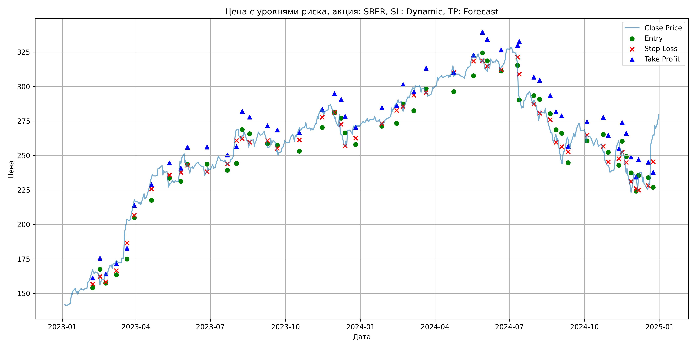
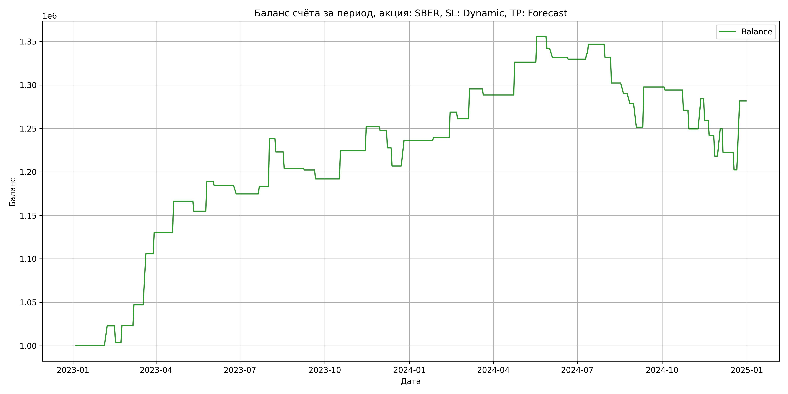

# Результаты торговой стратегии для SBER

**Дата:** 2025-05-18 18:37:31  
**Стратегия:** SBER,_SL_Dynamic,_TP_Forecast

## Конфигурация

```json
{
    "TICKER": "SBER",
    "EXCHANGE": "MOEX",
    "START_DATE": "2023-01-01",
    "END_DATE": "2024-12-31",
    "INTERVAL": "1d",
    "CAPITAL": 1000000,
    "RISK_PERCENT": 0.02,
    "PROFIT_TO_RISK": 3,
    "ATR_MULTIPLIER": 1.5,
    "ATR_WINDOW": 14,
    "STOP_LOSS_METHOD": "Dynamic",
    "TAKE_PROFIT_METHOD": "Forecast"
}
```

## Метрики эффективности

- **Начальный баланс:** 1000000.00
- **Конечный баланс:** 1281607.09
- **Прибыль/Убыток:** 281607.09 (28.16% за период тестирования)
- **Количество сделок:** 52
- **Процент выигрышных сделок:** 44.23% (23 выигрышных, 29 убыточных)
- **Средняя прибыль:** 31111.49
- **Средний убыток:** -14964.04
- **Максимальная прибыль:** 79261.36
- **Максимальный убыток:** -29597.98
- **Коэффициент прибыли:** 1.65
- **Максимальная просадка:** -11.31%

## Графики

### График цены с уровнями риска



### График баланса счёта



## Завершённые сделки

**Всего сделок:** 52

| Сделка № | Дата | Тип | Покупка / продажа | Количество акций | Цена | Stop Loss в момент сделки | Take Profit в момент сделки | Прибыль / убыток | Прибыль / убыток с учётом комиссии |
|:--------:|:----:|:---:|:-----------------:|:----------------:|:----:|:-------------------------:|:---------------------------:|:----------------:|:----------------------------------:|
| 1 | 2023-02-06 23:59:59 | long | buy | 0 | 0.00 | 156.70 | 161.18 | 22843.38 | 22363.48 |
| 2 | 2023-02-15 23:59:59 | long | buy | 0 | 0.00 | 162.19 | 175.44 | -19094.93 | -19563.50 |
| 3 | 2023-02-22 23:59:59 | long | buy | 0 | 0.00 | 158.27 | 164.06 | 19403.23 | 18921.85 |
| 4 | 2023-03-07 23:59:59 | long | buy | 0 | 0.00 | 166.41 | 171.54 | 23941.61 | 23452.56 |
| 5 | 2023-03-20 23:59:59 | long | buy | 0 | 0.00 | 186.58 | 182.71 | 58657.01 | 58137.64 |
| 6 | 2023-03-29 23:59:59 | long | buy | 0 | 0.00 | 206.61 | 213.92 | 24437.08 | 23906.91 |
| 7 | 2023-04-19 23:59:59 | long | buy | 0 | 0.00 | 225.66 | 228.89 | 36002.03 | 35459.16 |
| 8 | 2023-05-11 23:59:59 | long | buy | 0 | 0.00 | 235.78 | 244.60 | -11440.49 | -11978.72 |
| 9 | 2023-05-25 23:59:59 | long | buy | 0 | 0.00 | 237.73 | 240.79 | 34232.21 | 33673.78 |
| 10 | 2023-06-02 23:59:59 | long | buy | 0 | 0.00 | 242.91 | 255.95 | -4387.67 | -4937.92 |
| 11 | 2023-06-26 23:59:59 | long | buy | 0 | 0.00 | 238.22 | 256.15 | -9910.86 | -10455.81 |
| 12 | 2023-07-21 23:59:59 | long | buy | 0 | 0.00 | 243.96 | 250.32 | 8414.81 | 7863.17 |
| 13 | 2023-08-01 23:59:59 | long | buy | 0 | 0.00 | 260.85 | 256.34 | 55071.26 | 54494.42 |
| 14 | 2023-08-08 23:59:59 | long | buy | 0 | 0.00 | 262.18 | 281.93 | -15216.30 | -15783.86 |
| 15 | 2023-08-17 23:59:59 | long | buy | 0 | 0.00 | 259.53 | 277.85 | -18949.73 | -19509.73 |
| 16 | 2023-09-08 23:59:59 | long | buy | 0 | 0.00 | 260.85 | 271.43 | -1805.96 | -2363.50 |
| 17 | 2023-09-20 23:59:59 | long | buy | 0 | 0.00 | 255.19 | 268.46 | -10257.94 | -10813.12 |
| 18 | 2023-10-17 23:59:59 | long | buy | 0 | 0.00 | 261.26 | 266.46 | 32426.71 | 31859.95 |
| 19 | 2023-11-14 23:59:59 | long | buy | 0 | 0.00 | 277.74 | 283.50 | 27594.08 | 27012.99 |
| 20 | 2023-11-29 23:59:59 | long | buy | 0 | 0.00 | 281.26 | 294.91 | -4270.88 | -4848.76 |
| 21 | 2023-12-07 23:59:59 | long | buy | 0 | 0.00 | 272.53 | 290.64 | -20066.71 | -20634.17 |
| 22 | 2023-12-12 23:59:59 | long | buy | 0 | 0.00 | 256.98 | 278.38 | -20828.17 | -21387.57 |
| 23 | 2023-12-25 23:59:59 | long | buy | 0 | 0.00 | 262.54 | 270.48 | 29410.23 | 28837.52 |
| 24 | 2024-01-26 23:59:59 | long | buy | 0 | 0.00 | 273.02 | 284.63 | 3276.73 | 2703.79 |
| 25 | 2024-02-13 23:59:59 | long | buy | 0 | 0.00 | 282.63 | 286.28 | 29258.93 | 28670.66 |
| 26 | 2024-02-21 23:59:59 | long | buy | 0 | 0.00 | 285.51 | 301.42 | -7631.58 | -8213.97 |
| 27 | 2024-03-05 23:59:59 | long | buy | 0 | 0.00 | 293.69 | 296.10 | 34346.00 | 33746.27 |
| 28 | 2024-03-20 23:59:59 | long | buy | 0 | 0.00 | 295.66 | 313.32 | -6993.99 | -7588.08 |
| 29 | 2024-04-23 23:59:59 | long | buy | 0 | 0.00 | 310.05 | 310.17 | 37783.91 | 37169.19 |
| 30 | 2024-05-17 23:59:59 | long | buy | 0 | 0.00 | 318.31 | 322.76 | 29495.96 | 28868.98 |
| 31 | 2024-05-28 23:59:59 | long | buy | 0 | 0.00 | 318.65 | 339.32 | -13804.52 | -14424.54 |
| 32 | 2024-06-03 23:59:59 | long | buy | 0 | 0.00 | 314.76 | 334.13 | -10451.36 | -11064.79 |
| 33 | 2024-06-20 23:59:59 | long | buy | 0 | 0.00 | 312.25 | 326.50 | -1777.21 | -2389.88 |
| 34 | 2024-07-10 23:59:59 | long | buy | 0 | 0.00 | 321.24 | 329.86 | 6553.60 | 5936.41 |
| 35 | 2024-07-12 23:59:59 | long | buy | 0 | 0.00 | 309.02 | 332.51 | 10580.84 | 10012.46 |
| 36 | 2024-07-30 23:59:59 | long | buy | 0 | 0.00 | 287.25 | 306.82 | -15001.46 | -15615.45 |
| 37 | 2024-08-06 23:59:59 | long | buy | 0 | 0.00 | 280.63 | 304.50 | -29597.98 | -30196.69 |
| 38 | 2024-08-19 23:59:59 | long | buy | 0 | 0.00 | 275.92 | 293.37 | -11887.70 | -12481.56 |
| 39 | 2024-08-26 23:59:59 | long | buy | 0 | 0.00 | 259.61 | 281.58 | -11772.84 | -12360.06 |
| 40 | 2024-09-02 23:59:59 | long | buy | 0 | 0.00 | 256.37 | 278.66 | -27157.51 | -27731.68 |
| 41 | 2024-09-10 23:59:59 | long | buy | 0 | 0.00 | 252.65 | 256.53 | 46238.22 | 45640.92 |
| 42 | 2024-10-03 23:59:59 | long | buy | 0 | 0.00 | 264.74 | 274.35 | -3458.66 | -4049.98 |
| 43 | 2024-10-23 23:59:59 | long | buy | 0 | 0.00 | 256.61 | 277.46 | -23282.47 | -23865.73 |
| 44 | 2024-10-29 23:59:59 | long | buy | 0 | 0.00 | 245.30 | 264.61 | -21476.42 | -22047.91 |
| 45 | 2024-11-11 23:59:59 | long | buy | 0 | 0.00 | 247.66 | 254.79 | 34814.04 | 34224.74 |
| 46 | 2024-11-15 23:59:59 | long | buy | 0 | 0.00 | 252.44 | 273.77 | -25198.30 | -25771.79 |
| 47 | 2024-11-20 23:59:59 | long | buy | 0 | 0.00 | 244.93 | 266.10 | -17412.76 | -17969.85 |
| 48 | 2024-11-26 23:59:59 | long | buy | 0 | 0.00 | 231.06 | 248.90 | -23467.55 | -24023.40 |
| 49 | 2024-12-02 23:59:59 | long | buy | 0 | 0.00 | 225.91 | 234.32 | 31521.11 | 30947.28 |
| 50 | 2024-12-05 23:59:59 | long | buy | 0 | 0.00 | 224.88 | 246.93 | -27099.98 | -27657.34 |
| 51 | 2024-12-17 23:59:59 | long | buy | 0 | 0.00 | 228.06 | 245.15 | -20255.30 | -20803.17 |
| 52 | 2024-12-23 23:59:59 | long | buy | 0 | 0.00 | 245.37 | 237.83 | 79261.36 | 78673.20 |
